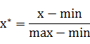
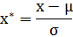
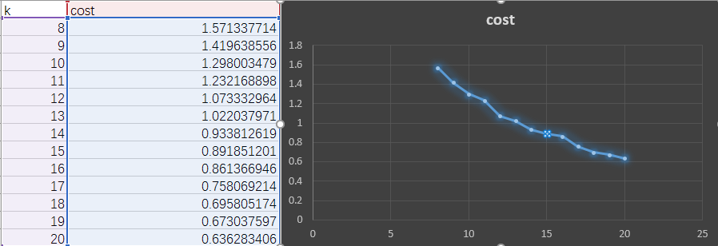

### Progress Records

#### April 14th, 2017 Friday

##### Group Meeting

* 数据预处理有问题：未归一化处理，导致权重不均
* 数据清洗过程是否欠妥：195万条数据--->>>10万7千条数据
* 展示需要进一步改进：哪些维度导致其被分类在异常类？（需要思考）
* K值的优化（寻找cost拐点）
* Kibana查询优化后聚类结果，并将结果及时发布到群里

##### Today's work

完成以上问题的处理。

##### 数据归一化--Normalization

数据标准化（归一化）处理是数据挖掘的一项基础工作，不同评价指标往往具有不同的量纲和量纲单位，这样的情况会影响到数据分析的结果，为了消除指标之间的量纲影响，需要进行数据标准化处理，以解决数据指标之间的可比性。原始数据经过数据标准化处理后，各指标处于同一数量级，适合进行综合对比评价。以下是两种常用的归一化方法：

* Min-Max Normalization

也称为离差标准化，是对原始数据的线性变换，使结果值映射到[0 - 1]之间。转换函数如下：

* Z-score Normalization

基于原始数据的均值（mean）和标准差（Standard deviation）进行数据的标准化。经过处理的数据符合标准正态分布，即均值为0，标准差为1，转化函数为：

#### April 17th, 2017 Monday

##### Backview & New week arrangments

上周完成了归一化和寻找合适K值（通过计算cost的方式）的代码。昨天拿到了另外两个特征的数据，今天可以在新数据集下完成测试，希望能有更好的效果。

本周任务较重，大部分时间应该花在设计和开发上。

* 完成一或两种新攻击（异常）的检测
* 分布式规则引擎的框架（思考论文是否可用）
* 准备开始撰写论文

##### Today's work arrangements

* 新数据集的处理，处理逻辑优化
* 仔细检查，归一化的过程是否可以再完善
* 测试代码，完善一下代码（周末完成的代码）
* New Attacks的检测方法（数据要求参考hogzilla）
* hogzilla & DBNS

#### April 18th, 2017 Tuesday

##### Work Arrangements

* 进一步标注结果，翻译被标准化的数据
* 试一试Max-Min标准化数据后的测试效果
* 新的异常类型检测（port scan, DoS(UDP amplification), DNS tunnel etc.）数据要求
* 与人杰讨论将异常检测结果放到前端
* Save model for ShengjieLuo

##### Self-rate

* 没有尝试新的标准化方法

* 新的异常类型：DDoS、ICMP Tunnel、Portscan

* 离线分析结果写入MySQL(.12)表中

* SaveModel

  > *clusters.save(sc, "target/org/apache/spark/KMeansExample/KMeansModel")*

