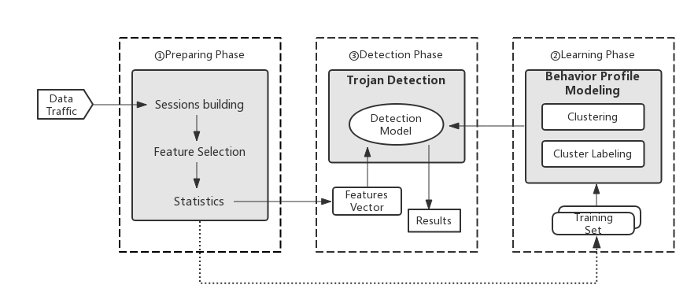

#### k=8

```shell
The threshold is 536.235
Cluster:2 Number:3
Cluster:5 Number:1
Cluster:4 Number:2
Cluster:7 Number:15
Cluster:1 Number:1
Cluster:3 Number:1
Cluster:6 Number:3
Cluster:0 Number:107221
Selecting anomalous cluster...
How many clusters? Clusters Number: 8
Center Point of Cluster 0:
[2.6887363482899804,3.367009014156229,5.6494627283865295,0.2510021380193687,0.9999999999999999,0.742346715408312]
Center Point of Cluster 1:
[77690.0,84168.0181818,1398423.62123,0.99946881141,1.0,1.53371052532E-5]
Center Point of Cluster 2:
[99913.66666666666,3.880962557463333,3.4387146794756664,0.5870692550026666,1.0,0.34104775356533334]
Center Point of Cluster 3:
[0.0,2719.42857143,56915.8978289,1.05064089094E-4,1.0,0.00105025468676]
Center Point of Cluster 4:
[0.0,1453.9,34649.143289650005,9.62705632375E-5,1.0,9.302886908604999E-4]
Center Point of Cluster 5:
[167053.0,1.25210084034,1.19340262088,0.590604026846,1.0,0.182835820896]
Center Point of Cluster 6:
[59805.666666666664,0.692724642054,0.3694288765801666,0.26462213827939995,1.0,0.5283086461553332]
Center Point of Cluster 7:
[0.0,1439.5433386227335,8741.994330216665,0.0676334300006,1.0,0.10494856894968786]
Got anomalous clusters...---------->>>>>>>>

The index of anomalous cluster is 2
The points in this cluster are as follows: 
[97841.0,0.544809228039,0.437771447757,0.42671009772,1.0,0.604824813326]
[95608.0,10.2487961477,8.7403233709,0.888018794049,1.0,0.122716894977]
[106292.0,0.849282296651,1.13804921977,0.446478873239,1.0,0.295601552393]

The index of anomalous cluster is 5
The points in this cluster are as follows:
[167053.0,1.25210084034,1.19340262088,0.590604026846,1.0,0.182835820896]

The index of anomalous cluster is 4
The points in this cluster are as follows:
[0.0,740.8,24918.5302083,8.9992800576E-5,1.0,0.00134807225667]
[0.0,2167.0,44379.756371,1.02548325899E-4,1.0,5.12505125051E-4]

The index of anomalous cluster is 7
The points in this cluster are as follows:
[0.0,239.935483871,5192.11644961,2.24074572018E-4,1.0,3.12402374258E-4]
[0.0,1104.75,14977.9347826,0.0,1.0,0.0153741804205]
[0.0,344.676470588,7493.43123799,1.70663025855E-4,1.0,0.00238237045861]
[0.0,389.75,11735.2325581,0.00128287363695,1.0,0.00383877159309]
[0.0,4309.5,8907.18656716,1.16022740457E-4,1.0,0.0184433360399]
[0.0,190.0,4998.48630137,0.00526315789474,1.0,0.00261780104712]
[0.0,4066.0,4066.0,1.0,1.0,1.0]
[0.0,362.388888889,4791.23759791,7.66518473095E-4,1.0,0.00290475462468]
[0.0,609.049235993,8699.12439682,2.78761185293E-6,1.0,0.00279139149335]
[0.0,391.2,4880.54810496,0.0,1.0,0.204487506374]
[0.0,1477.0,8112.41102757,6.77048070413E-4,1.0,0.0020297699594]
[0.0,309.4,4632.08746356,0.00129282482224,1.0,0.239690721649]
[0.0,464.0,16578.96875,0.00431034482759,1.0,0.00430107526882]
[0.0,1085.5,12844.5152587,1.31604922024E-4,1.0,0.065183091184]
[0.0,6250.0,13220.6344569,2.63529411765E-4,1.0,0.00987136175859]

The index of anomalous cluster is 1
The points in this cluster are as follows: 
[77690.0,84168.0181818,1398423.62123,0.99946881141,1.0,1.53371052532E-5]

The index of anomalous cluster is 3
The points in this cluster are as follows: 
[0.0,2719.42857143,56915.8978289,1.05064089094E-4,1.0,0.00105025468676]

The index of anomalous cluster is 6
The points in this cluster are as follows: 
[38369.0,0.954158302147,0.0888580369825,0.0397530693172,1.0,0.335750914202]
[65657.0,0.637529137529,0.569460871648,0.254113345521,1.0,0.6128113879]
[75391.0,0.486486486486,0.44996772111,0.5,1.0,0.636363636364]
```

#### Wednesday April 12th, 2017

```shell
u928@master:~/fl/kmeansTest$ spark-submit --class "nadsTrojan" ./trojan-kmeans_2.11-1.0.jar /tcpheader/trainSet.txt /tcpheader/trainSet.txt 8 50 3 2>&1 | grep "debug"
[debug] The threshold is 536.235
[debug] Cluster:2 Number:2
[debug] Cluster:5 Number:1
[debug] Cluster:4 Number:3
[debug] Cluster:7 Number:3
[debug] Cluster:1 Number:1
[debug] Cluster:3 Number:2
[debug] Cluster:6 Number:22
[debug] Cluster:0 Number:107213
[debug] Selecting anomalous cluster...
[debug] How many clusters? Clusters Number: 8
[debug] Center Point of Cluster 0:
[debug] Center Point of Cluster 1:
[debug] Center Point of Cluster 2:
[debug] Center Point of Cluster 3:
[debug] Center Point of Cluster 4:
[debug] Center Point of Cluster 5:
[debug] Center Point of Cluster 6:
[debug] Center Point of Cluster 7:
[debug] Got anomalous clusters...---------->>>>>>>>
[debug] The index of anomalous cluster is 2
[debug] The points in this cluster are as follows: 
[debug] In cluster 2: [0.0,2167.0,44379.756371,1.02548325899E-4,1.0,5.12505125051E-4]
[debug] In cluster 2: [0.0,2719.42857143,56915.8978289,1.05064089094E-4,1.0,0.00105025468676]
[debug] =======================================
[debug] The index of anomalous cluster is 5
[debug] The points in this cluster are as follows: 
[debug] In cluster 5: [167053.0,1.25210084034,1.19340262088,0.590604026846,1.0,0.182835820896]
[debug] =======================================
[debug] The index of anomalous cluster is 4
[debug] The points in this cluster are as follows: 
[debug] In cluster 4: [17016.0,3.7,4.29779470094,0.628733997155,1.0,0.354983202688]
[debug] In cluster 4: [38369.0,0.954158302147,0.0888580369825,0.0397530693172,1.0,0.335750914202]
[debug] In cluster 4: [18420.0,0.92987804878,1.28885251269,0.252459016393,1.0,0.424960505529]
[debug] =======================================
[debug] The index of anomalous cluster is 7
[debug] The points in this cluster are as follows: 
[debug] In cluster 7: [97841.0,0.544809228039,0.437771447757,0.42671009772,1.0,0.604824813326]
[debug] In cluster 7: [95608.0,10.2487961477,8.7403233709,0.888018794049,1.0,0.122716894977]
[debug] In cluster 7: [106292.0,0.849282296651,1.13804921977,0.446478873239,1.0,0.295601552393]
[debug] =======================================
[debug] The index of anomalous cluster is 1
[debug] The points in this cluster are as follows: 
[debug] In cluster 1: [77690.0,84168.0181818,1398423.62123,0.99946881141,1.0,1.53371052532E-5]
[debug] =======================================
[debug] The index of anomalous cluster is 3
[debug] The points in this cluster are as follows: 
[debug] In cluster 3: [65657.0,0.637529137529,0.569460871648,0.254113345521,1.0,0.6128113879]
[debug] In cluster 3: [75391.0,0.486486486486,0.44996772111,0.5,1.0,0.636363636364]
[debug] =======================================
[debug] The index of anomalous cluster is 6
[debug] The points in this cluster are as follows: 
[debug] In cluster 6: [5252.0,3.11904761905,3.23838797814,0.335877862595,1.0,0.554913294798]
[debug] In cluster 6: [6761.0,2.28301886792,2.30614937978,0.404958677686,1.0,0.505747126437]
[debug] In cluster 6: [4752.0,1.3676975945,1.44781309693,0.268844221106,1.0,0.595065312046]
[debug] In cluster 6: [5343.0,1.37654320988,1.51076356946,0.295964125561,1.0,0.615584415584]
[debug] In cluster 6: [6386.0,2.62962962963,2.71214116408,0.366197183099,1.0,0.530612244898]
[debug] In cluster 6: [3739.0,1.80225988701,1.90839195158,0.294670846395,1.0,0.592741935484]
[debug] In cluster 6: [12687.0,6.0,7.328125,0.166666666667,1.0,0.642857142857]
[debug] In cluster 6: [11887.0,1.5,1.43042071197,0.166666666667,1.0,0.6]
[debug] In cluster 6: [9887.0,0.992551635898,0.161954507379,0.106440771604,1.0,0.476000458663]
[debug] In cluster 6: [6701.0,0.825196346545,0.64772050822,0.0609041227406,1.0,0.176734877858]
[debug] In cluster 6: [11374.0,1.0,0.932038834951,0.0,1.0,0.5]
[debug] In cluster 6: [5558.0,6.29145347932,3.68229685671,0.891745970476,1.0,0.891161187719]
[debug] In cluster 6: [8975.0,1.05882352941,1.10482529118,0.166666666667,1.0,0.628571428571]
[debug] In cluster 6: [8812.0,0.625,0.609324758842,0.2,1.0,0.538461538462]
[debug] In cluster 6: [10559.0,3.75,3.55627009646,0.166666666667,1.0,0.631578947368]
[debug] In cluster 6: [5079.0,2.32653061224,2.61075949367,0.473684210526,1.0,0.521472392638]
[debug] In cluster 6: [6573.0,1.72164948454,1.75881073241,0.359281437126,1.0,0.556818181818]
[debug] In cluster 6: [4399.0,1.28729281768,1.38994209566,0.25321888412,1.0,0.601449275362]
[debug] In cluster 6: [4370.0,1.4858490566,1.61521191918,0.263492063492,1.0,0.599620493359]
[debug] In cluster 6: [6615.0,1.15909090909,1.21840209561,0.352941176471,1.0,0.573684210526]
[debug] In cluster 6: [11406.0,2.5625,2.35587761675,0.365853658537,1.0,0.526315789474]
[debug] In cluster 6: [4488.0,1.05143989983,0.470761643917,0.286593232113,1.0,0.25212349321]
[debug] =======================================

```

```shell
u928@master:~/fl/kmeansTest$ spark-submit --class "nadsTrojan" ./trojan-kmeans_2.11-1.0.jar /tcpheader/trainSet.txt /tcpheader/dataSet.txt 8 50 3 2>&1 | grep "debug"
[debug] The threshold is 536.235
[debug] Cluster:2 Number:4
[debug] Cluster:5 Number:1
[debug] Cluster:4 Number:2
[debug] Cluster:7 Number:26
[debug] Cluster:1 Number:1
[debug] Cluster:3 Number:2
[debug] Cluster:6 Number:6
[debug] Cluster:0 Number:107205
[debug] Selecting anomalous cluster...
[debug] How many clusters? Clusters Number: 8
[debug] Center Point of Cluster 0:
[debug] [2.6891376335059003,3.246403089189776,5.217127148719398,0.25099228665599915,1.0,0.7424157379785072]
[debug] Center Point of Cluster 1:
[debug] [77690.0,84168.0181818,1398423.62123,0.99946881141,1.0,1.53371052532E-5]
[debug] Center Point of Cluster 2:
[debug] [93783.0,3.0323435397189997,2.6915279398842498,0.565301941252,1.0,0.414876724265]
[debug] Center Point of Cluster 3:
[debug] [0.0,2443.214285715,50647.82709995,1.038062074965E-4,1.0,7.813799059054999E-4]
[debug] Center Point of Cluster 4:
[debug] [52013.0,0.795843719838,0.32915945431524996,0.14693320741910001,1.0,0.474281151051]
[debug] Center Point of Cluster 5:
[debug] [167053.0,1.25210084034,1.19340262088,0.590604026846,1.0,0.182835820896]
[debug] Center Point of Cluster 6:
[debug] [0.0,1672.4666666666665,15712.63600243333,0.0010130575998174999,1.0,0.016652758746945]
[debug] Center Point of Cluster 7:
[debug] [0.0,972.4069388306153,4161.982937262307,0.23387164290607343,1.0,0.22898626395304136]
[debug] Got anomalous clusters...---------->>>>>>>>
[debug] The index of anomalous cluster is 2
[debug] The points in this cluster are as follows: 
[debug] In cluster 2: 202.121.244.200 [97841.0,0.544809228039,0.437771447757,0.42671009772,1.0,0.604824813326]
[debug] In cluster 2: 210.35.96.2 [95608.0,10.2487961477,8.7403233709,0.888018794049,1.0,0.122716894977]
[debug] In cluster 2: 210.35.96.6 [106292.0,0.849282296651,1.13804921977,0.446478873239,1.0,0.295601552393]
[debug] In cluster 2: 202.121.64.5 [75391.0,0.486486486486,0.44996772111,0.5,1.0,0.636363636364]
[debug] =======================================
[debug] The index of anomalous cluster is 5
[debug] The points in this cluster are as follows: 
[debug] In cluster 5: 202.121.209.11 [167053.0,1.25210084034,1.19340262088,0.590604026846,1.0,0.182835820896]
[debug] =======================================
[debug] The index of anomalous cluster is 4
[debug] The points in this cluster are as follows: 
[debug] In cluster 4: 202.121.244.201 [65657.0,0.637529137529,0.569460871648,0.254113345521,1.0,0.6128113879]
[debug] In cluster 4: 202.121.64.130 [38369.0,0.954158302147,0.0888580369825,0.0397530693172,1.0,0.335750914202]
[debug] =======================================
[debug] The index of anomalous cluster is 7
[debug] The points in this cluster are as follows: 
[debug] In cluster 7: 223.105.4.244 [0.0,2809.44585987,2809.44585987,0.999990931412,1.0,1.0]
[debug] In cluster 7: 182.254.35.146 [0.0,239.935483871,5192.11644961,2.24074572018E-4,1.0,3.12402374258E-4]
[debug] In cluster 7: 121.205.163.167 [0.0,344.676470588,7493.43123799,1.70663025855E-4,1.0,0.00238237045861]
[debug] In cluster 7: 182.254.17.32 [0.0,129.225806452,3484.73757372,2.49625561658E-4,1.0,3.71563041863E-4]
[debug] In cluster 7: 202.195.235.30 [0.0,83.0,2618.25252525,0.0200803212851,1.0,0.0277777777778]
[debug] In cluster 7: 1.165.83.79 [0.0,226.5,3493.12259615,0.0,1.0,0.0281318681319]
[debug] In cluster 7: 137.74.86.230 [0.0,2026.88235294,2026.88235294,1.0,1.0,1.0]
[debug] In cluster 7: 14.113.67.233 [0.0,242.0,2210.09090909,0.00413223140496,1.0,0.0493827160494]
[debug] In cluster 7: 140.207.55.22 [0.0,4309.5,8907.18656716,1.16022740457E-4,1.0,0.0184433360399]
[debug] In cluster 7: 54.192.75.206 [0.0,190.0,4998.48630137,0.00526315789474,1.0,0.00261780104712]
[debug] In cluster 7: 175.19.209.140 [0.0,4066.0,4066.0,1.0,1.0,1.0]
[debug] In cluster 7: 117.45.74.51 [0.0,117.0,3088.86259542,0.0042735042735,1.0,0.0360169491525]
[debug] In cluster 7: 210.41.98.241 [0.0,282.0,2887.27777778,0.00177304964539,1.0,0.0150176678445]
[debug] In cluster 7: 210.44.112.103 [0.0,143.25,3559.92248062,0.00261780104712,1.0,0.00779896013865]
[debug] In cluster 7: 202.201.11.14 [0.0,362.388888889,4791.23759791,7.66518473095E-4,1.0,0.00290475462468]
[debug] In cluster 7: 184.50.87.34 [0.0,146.930232558,4282.44859813,0.00110794555239,1.0,0.00204370382015]
[debug] In cluster 7: 210.32.175.67 [0.0,609.049235993,8699.12439682,2.78761185293E-6,1.0,0.00279139149335]
[debug] In cluster 7: 121.235.42.23 [0.0,177.0,3160.3671875,0.00282485875706,1.0,0.213483146067]
[debug] In cluster 7: 115.231.232.195 [0.0,2261.0,2261.0,1.0,1.0,1.0]
[debug] In cluster 7: 58.221.44.93 [0.0,2051.0,2051.0,0.997562164798,1.0,1.0]
[debug] In cluster 7: 218.64.159.165 [0.0,391.2,4880.54810496,0.0,1.0,0.204487506374]
[debug] In cluster 7: 222.94.116.250 [0.0,1477.0,8112.41102757,6.77048070413E-4,1.0,0.0020297699594]
[debug] In cluster 7: 95.211.209.158 [0.0,1958.66666667,2101.60416667,1.0,1.0,5.10290865794E-4]
[debug] In cluster 7: 219.223.240.99 [0.0,102.529411765,2226.42541924,0.00229489386116,1.0,0.0272727272727]
[debug] In cluster 7: 121.224.121.237 [0.0,309.4,4632.08746356,0.00129282482224,1.0,0.239690721649]
[debug] In cluster 7: 117.21.201.1 [0.0,227.0,4177.48717949,0.0352422907489,1.0,0.0701754385965]
[debug] =======================================
[debug] The index of anomalous cluster is 1
[debug] The points in this cluster are as follows: 
[debug] In cluster 1: 202.121.66.133 [77690.0,84168.0181818,1398423.62123,0.99946881141,1.0,1.53371052532E-5]
[debug] =======================================
[debug] The index of anomalous cluster is 3
[debug] The points in this cluster are as follows: 
[debug] In cluster 3: 2.17.49.71 [0.0,2167.0,44379.756371,1.02548325899E-4,1.0,5.12505125051E-4]
[debug] In cluster 3: 202.119.25.74 [0.0,2719.42857143,56915.8978289,1.05064089094E-4,1.0,0.00105025468676]
[debug] =======================================
[debug] The index of anomalous cluster is 6
[debug] The points in this cluster are as follows: 
[debug] In cluster 6: 221.130.188.246 [0.0,1104.75,14977.9347826,0.0,1.0,0.0153741804205]
[debug] In cluster 6: 58.205.220.24 [0.0,740.8,24918.5302083,8.9992800576E-5,1.0,0.00134807225667]
[debug] In cluster 6: 111.161.50.19 [0.0,389.75,11735.2325581,0.00128287363695,1.0,0.00383877159309]
[debug] In cluster 6: 110.210.27.245 [0.0,1085.5,12844.5152587,1.31604922024E-4,1.0,0.065183091184]
[debug] In cluster 6: 180.153.93.66 [0.0,464.0,16578.96875,0.00431034482759,1.0,0.00430107526882]
[debug] In cluster 6: 101.4.56.88 [0.0,6250.0,13220.6344569,2.63529411765E-4,1.0,0.00987136175859]
[debug] =======================================
```

##### k=6, iterationNum=100, runtimes=3

```shell
u928@master:~/fl/kmeansTest$ spark-submit --class "nadsTrojan" ./trojan-kmeans_2.11-1.0.jar /tcpheader/trainSet.txt /tcpheader/dataSet.txt 6 100 3 2>&1 | grep "debug"
[debug] The threshold is 536.235
[debug] Cluster:2 Number:3
[debug] Cluster:5 Number:1
[debug] Cluster:4 Number:3
[debug] Cluster:1 Number:1
[debug] Cluster:3 Number:3
[debug] Cluster:0 Number:107236
[debug] Selecting anomalous cluster...
[debug] How many clusters? Clusters Number: 6
[debug] Center Point of Cluster 0:
[debug] [2.688360252154127,3.567899059888344,6.871488661956645,0.25097648869805605,1.0,0.742257557176031]
[debug] Center Point of Cluster 1:
[debug] [77690.0,84168.0181818,1398423.62123,0.99946881141,1.0,1.53371052532E-5]
[debug] Center Point of Cluster 2:
[debug] [59805.666666666664,0.692724642054,0.3694288765801666,0.26462213827939995,1.0,0.5283086461553332]
[debug] Center Point of Cluster 3:
[debug] [0.0,1875.7428571433334,42071.39480273333,9.920173852299998E-5,1.0,9.702773561603333E-4]
[debug] Center Point of Cluster 4:
[debug] [99913.66666666666,3.880962557463333,3.4387146794756664,0.5870692550026666,1.0,0.34104775356533334]
[debug] Center Point of Cluster 5:
[debug] [167053.0,1.25210084034,1.19340262088,0.590604026846,1.0,0.182835820896]
[debug] Got anomalous clusters...---------->>>>>>>>
[debug] =======================================
[debug] The index of anomalous cluster is 2
[debug] The points in this cluster are as follows: 
[debug] In cluster 2: 202.121.64.130 [38369.0,0.954158302147,0.0888580369825,0.0397530693172,1.0,0.335750914202]
[debug] In cluster 2: 202.121.244.201 [65657.0,0.637529137529,0.569460871648,0.254113345521,1.0,0.6128113879]
[debug] In cluster 2: 202.121.64.5 [75391.0,0.486486486486,0.44996772111,0.5,1.0,0.636363636364]
[debug] =======================================
[debug] The index of anomalous cluster is 5
[debug] The points in this cluster are as follows: 
[debug] In cluster 5: 202.121.209.11 [167053.0,1.25210084034,1.19340262088,0.590604026846,1.0,0.182835820896]
[debug] =======================================
[debug] The index of anomalous cluster is 4
[debug] The points in this cluster are as follows: 
[debug] In cluster 4: 202.121.244.200 [97841.0,0.544809228039,0.437771447757,0.42671009772,1.0,0.604824813326]
[debug] In cluster 4: 210.35.96.2 [95608.0,10.2487961477,8.7403233709,0.888018794049,1.0,0.122716894977]
[debug] In cluster 4: 210.35.96.6 [106292.0,0.849282296651,1.13804921977,0.446478873239,1.0,0.295601552393]
[debug] =======================================
[debug] The index of anomalous cluster is 1
[debug] The points in this cluster are as follows: 
[debug] In cluster 1: 202.121.66.133 [77690.0,84168.0181818,1398423.62123,0.99946881141,1.0,1.53371052532E-5]
[debug] =======================================
[debug] The index of anomalous cluster is 3
[debug] The points in this cluster are as follows: 
[debug] In cluster 3: 58.205.220.24 [0.0,740.8,24918.5302083,8.9992800576E-5,1.0,0.00134807225667]
[debug] In cluster 3: 2.17.49.71 [0.0,2167.0,44379.756371,1.02548325899E-4,1.0,5.12505125051E-4]
[debug] In cluster 3: 202.119.25.74 [0.0,2719.42857143,56915.8978289,1.05064089094E-4,1.0,0.00105025468676]
[debug] =======================================
[debug] [Info] There are 11 anomalous IPs among 5 clusters.
```

###### General Procedure



###### 数据字段如下：

| IP地址        | DNS次数 | 上下行包数比例 | 上下行字节比例 | SYN包占比 | PSH包占比 | Small包占比 |
| ----------- | ----- | ------- | ------- | ------ | ------ | -------- |
| 106.75.76.5 | 0     | 0.2647  | 0.7799  | 0      | 1.0    | 0.44     |

##### k=8, iterationNum=100, runtimes=5

```shell
u928@master:~/fl/kmeansTest$ spark-submit --class "nadsTrojan" ./trojan-kmeans_2.11-1.0.jar /tcpheader/trainSet.txt /tcpheader/dataSet.txt 8 100 5 2>&1 | grep "debug"
[debug] The threshold is 536.235
[debug] Cluster:2 Number:1
[debug] Cluster:5 Number:2
[debug] Cluster:4 Number:2
[debug] Cluster:7 Number:21
[debug] Cluster:1 Number:1
[debug] Cluster:3 Number:4
[debug] Cluster:6 Number:10
[debug] Cluster:0 Number:107206
[debug] Selecting anomalous cluster...
[debug] How many clusters? Clusters Number: 8
[debug] Center Point of Cluster 0:
[debug] [0.6593847359289592,3.5752890333217353,7.105363682996562,0.25096835540649715,1.0,0.7423104242940862]
[debug] Center Point of Cluster 1:
[debug] [77690.0,84168.0181818,1398423.62123,0.99946881141,1.0,1.53371052532E-5]
[debug] Center Point of Cluster 2:
[debug] [167053.0,1.25210084034,1.19340262088,0.590604026846,1.0,0.182835820896]
[debug] Center Point of Cluster 3:
[debug] [93783.0,3.0323435397189997,2.6915279398842498,0.565301941252,1.0,0.414876724265]
[debug] Center Point of Cluster 4:
[debug] [52013.0,0.795843719838,0.32915945431524996,0.14693320741910001,1.0,0.474281151051]
[debug] Center Point of Cluster 5:
[debug] [0.0,2443.214285715,50647.82709995,1.038062074965E-4,1.0,7.813799059054999E-4]
[debug] Center Point of Cluster 6:
[debug] [12102.300000000001,2.2118753214088005,2.3065484031162002,0.2220154110357,1.0,0.5323729013612]
[debug] Center Point of Cluster 7:
[debug] [4598.857142857142,1.5937488896446188,1.3716132629391666,0.2943413427739095,1.0,0.5370320721764763]
[debug] Got anomalous clusters...---------->>>>>>>>
[debug] =======================================
[debug] The index of anomalous cluster is 2
[debug] The points in this cluster are as follows: 
[debug] In cluster 2: 202.121.209.11 [167053.0,1.25210084034,1.19340262088,0.590604026846,1.0,0.182835820896]
[debug] =======================================
[debug] The index of anomalous cluster is 5
[debug] The points in this cluster are as follows: 
[debug] In cluster 5: 2.17.49.71 [0.0,2167.0,44379.756371,1.02548325899E-4,1.0,5.12505125051E-4]
[debug] In cluster 5: 202.119.25.74 [0.0,2719.42857143,56915.8978289,1.05064089094E-4,1.0,0.00105025468676]
[debug] =======================================
[debug] The index of anomalous cluster is 4
[debug] The points in this cluster are as follows: 
[debug] In cluster 4: 202.121.244.201 [65657.0,0.637529137529,0.569460871648,0.254113345521,1.0,0.6128113879]
[debug] In cluster 4: 202.121.64.130 [38369.0,0.954158302147,0.0888580369825,0.0397530693172,1.0,0.335750914202]
[debug] =======================================
[debug] The index of anomalous cluster is 7
[debug] The points in this cluster are as follows: 
[debug] In cluster 7: 202.96.209.20 [2397.0,1.30857142857,1.31880986026,0.25327510917,1.0,0.594059405941]
[debug] In cluster 7: 202.96.209.21 [5252.0,3.11904761905,3.23838797814,0.335877862595,1.0,0.554913294798]
[debug] In cluster 7: 202.96.209.22 [6761.0,2.28301886792,2.30614937978,0.404958677686,1.0,0.505747126437]
[debug] In cluster 7: 202.96.209.23 [4752.0,1.3676975945,1.44781309693,0.268844221106,1.0,0.595065312046]
[debug] In cluster 7: 202.96.209.24 [5343.0,1.37654320988,1.51076356946,0.295964125561,1.0,0.615584415584]
[debug] In cluster 7: 210.35.68.10 [2798.0,0.906129971084,0.0743494189702,0.0262952303831,1.0,0.261939596308]
[debug] In cluster 7: 202.96.209.25 [6386.0,2.62962962963,2.71214116408,0.366197183099,1.0,0.530612244898]
[debug] In cluster 7: 202.96.209.26 [3739.0,1.80225988701,1.90839195158,0.294670846395,1.0,0.592741935484]
[debug] In cluster 7: 210.35.115.224 [3124.0,0.031914893617,0.0512935546583,0.333333333333,1.0,0.876288659794]
[debug] In cluster 7: 210.35.112.161 [2965.0,1.15138924955,0.180708802491,0.0522778529544,1.0,0.294990947495]
[debug] In cluster 7: 202.121.64.7 [6701.0,0.825196346545,0.64772050822,0.0609041227406,1.0,0.176734877858]
[debug] In cluster 7: 210.35.115.234 [3274.0,0.868631062001,0.164599610285,0.110600706714,1.0,0.352660972405]
[debug] In cluster 7: 210.35.115.240 [3217.0,0.156862745098,0.19126305793,0.25,1.0,0.570621468927]
[debug] In cluster 7: 210.35.66.91 [5558.0,6.29145347932,3.68229685671,0.891745970476,1.0,0.891161187719]
[debug] In cluster 7: 202.121.66.121 [2785.0,0.318527918782,0.305301731781,0.247011952191,1.0,0.759384023099]
[debug] In cluster 7: 202.96.209.15 [5079.0,2.32653061224,2.61075949367,0.473684210526,1.0,0.521472392638]
[debug] In cluster 7: 202.96.209.16 [6573.0,1.72164948454,1.75881073241,0.359281437126,1.0,0.556818181818]
[debug] In cluster 7: 202.96.209.17 [4399.0,1.28729281768,1.38994209566,0.25321888412,1.0,0.601449275362]
[debug] In cluster 7: 202.96.209.18 [4370.0,1.4858490566,1.61521191918,0.263492063492,1.0,0.599620493359]
[debug] In cluster 7: 202.96.209.19 [6615.0,1.15909090909,1.21840209561,0.352941176471,1.0,0.573684210526]
[debug] In cluster 7: 210.35.115.110 [4488.0,1.05143989983,0.470761643917,0.286593232113,1.0,0.25212349321]
[debug] =======================================
[debug] The index of anomalous cluster is 1
[debug] The points in this cluster are as follows: 
[debug] In cluster 1: 202.121.66.133 [77690.0,84168.0181818,1398423.62123,0.99946881141,1.0,1.53371052532E-5]
[debug] =======================================
[debug] The index of anomalous cluster is 3
[debug] The points in this cluster are as follows: 
[debug] In cluster 3: 202.121.244.200 [97841.0,0.544809228039,0.437771447757,0.42671009772,1.0,0.604824813326]
[debug] In cluster 3: 210.35.96.2 [95608.0,10.2487961477,8.7403233709,0.888018794049,1.0,0.122716894977]
[debug] In cluster 3: 210.35.96.6 [106292.0,0.849282296651,1.13804921977,0.446478873239,1.0,0.295601552393]
[debug] In cluster 3: 202.121.64.5 [75391.0,0.486486486486,0.44996772111,0.5,1.0,0.636363636364]
[debug] =======================================
[debug] The index of anomalous cluster is 6
[debug] The points in this cluster are as follows: 
[debug] In cluster 6: 101.7.8.250 [17016.0,3.7,4.29779470094,0.628733997155,1.0,0.354983202688]
[debug] In cluster 6: 180.168.255.63 [12687.0,6.0,7.328125,0.166666666667,1.0,0.642857142857]
[debug] In cluster 6: 180.168.255.64 [11887.0,1.5,1.43042071197,0.166666666667,1.0,0.6]
[debug] In cluster 6: 210.35.114.120 [9887.0,0.992551635898,0.161954507379,0.106440771604,1.0,0.476000458663]
[debug] In cluster 6: 210.35.112.1 [18420.0,0.92987804878,1.28885251269,0.252459016393,1.0,0.424960505529]
[debug] In cluster 6: 202.120.2.171 [11374.0,1.0,0.932038834951,0.0,1.0,0.5]
[debug] In cluster 6: 180.168.255.11 [8975.0,1.05882352941,1.10482529118,0.166666666667,1.0,0.628571428571]
[debug] In cluster 6: 180.168.255.12 [8812.0,0.625,0.609324758842,0.2,1.0,0.538461538462]
[debug] In cluster 6: 180.168.255.52 [10559.0,3.75,3.55627009646,0.166666666667,1.0,0.631578947368]
[debug] In cluster 6: 180.168.255.56 [11406.0,2.5625,2.35587761675,0.365853658537,1.0,0.526315789474]
[debug] =======================================
[debug] [Info] There are 41 anomalous IPs among 7 clusters.
```

##### k=4, iterationNum=100, runtimes=5

```shell
u928@master:~/fl/kmeansTest$ spark-submit --class "nadsTrojan" ./trojan-kmeans_2.11-1.0.jar /tcpheader/trainSet.txt /tcpheader/dataSet.txt 4 100 5 2>&1 | grep "debug"
[debug] The threshold is 536.235
[debug] Cluster:2 Number:2
[debug] Cluster:1 Number:1
[debug] Cluster:3 Number:5
[debug] Cluster:0 Number:107239
[debug] Selecting anomalous cluster...
[debug] How many clusters? Clusters Number: 4
[debug] Center Point of Cluster 0:
[debug] [2.688285045552458,3.6202729618666383,8.048239377108926,0.25096947043174556,1.0,0.7422368197405882]
[debug] Center Point of Cluster 1:
[debug] [77690.0,84168.0181818,1398423.62123,0.99946881141,1.0,1.53371052532E-5]
[debug] Center Point of Cluster 2:
[debug] [136672.5,1.0506915684955,1.1657259203249999,0.5185414500425,1.0,0.23921868664450002]
[debug] Center Point of Cluster 3:
[debug] [74573.2,2.5743558603802,2.0572762896795003,0.4217190613214401,1.0,0.4624935293538]
[debug] Got anomalous clusters...---------->>>>>>>>
[debug] =======================================
[debug] The index of anomalous cluster is 2
[debug] The points in this cluster are as follows: 
[debug] In cluster 2: 202.121.209.11 [167053.0,1.25210084034,1.19340262088,0.590604026846,1.0,0.182835820896]
[debug] In cluster 2: 210.35.96.6 [106292.0,0.849282296651,1.13804921977,0.446478873239,1.0,0.295601552393]
[debug] =======================================
[debug] The index of anomalous cluster is 1
[debug] The points in this cluster are as follows: 
[debug] In cluster 1: 202.121.66.133 [77690.0,84168.0181818,1398423.62123,0.99946881141,1.0,1.53371052532E-5]
[debug] =======================================
[debug] The index of anomalous cluster is 3
[debug] The points in this cluster are as follows: 
[debug] In cluster 3: 202.121.244.200 [97841.0,0.544809228039,0.437771447757,0.42671009772,1.0,0.604824813326]
[debug] In cluster 3: 202.121.244.201 [65657.0,0.637529137529,0.569460871648,0.254113345521,1.0,0.6128113879]
[debug] In cluster 3: 202.121.64.130 [38369.0,0.954158302147,0.0888580369825,0.0397530693172,1.0,0.335750914202]
[debug] In cluster 3: 210.35.96.2 [95608.0,10.2487961477,8.7403233709,0.888018794049,1.0,0.122716894977]
[debug] In cluster 3: 202.121.64.5 [75391.0,0.486486486486,0.44996772111,0.5,1.0,0.636363636364]
[debug] =======================================
[debug] [Info] There are 8 anomalous IPs among 3 clusters.
```

##### k=4, iterationNum=100, runtimes=3

```shell
u928@master:~/fl/kmeansTest$ spark-submit --class "nadsTrojan" ./trojan-kmeans_2.11-1.0.jar /tcpheader/trainSet.txt /tcpheader/dataSet.txt 4 100 3 2>&1 | grep "debug"
[debug] The threshold is 536.235
[debug] Cluster:2 Number:1
[debug] Cluster:1 Number:1
[debug] Cluster:3 Number:5
[debug] Cluster:0 Number:107240
[debug] Selecting anomalous cluster...
[debug] How many clusters? Clusters Number: 4
[debug] Center Point of Cluster 0:
[debug] [3.0460462513987316,3.6202481006706315,8.048165156842792,0.2509675008644095,1.0,0.7422330293087946]
[debug] Center Point of Cluster 1:
[debug] [77690.0,84168.0181818,1398423.62123,0.99946881141,1.0,1.53371052532E-5]
[debug] Center Point of Cluster 2:
[debug] [167053.0,1.25210084034,1.19340262088,0.590604026846,1.0,0.182835820896]
[debug] Center Point of Cluster 3:
[debug] [88157.8,2.553380659281,2.267114526237,0.5030642221058,1.0,0.454463656992]
[debug] Got anomalous clusters...---------->>>>>>>>
[debug] =======================================
[debug] The index of anomalous cluster is 2
[debug] The points in this cluster are as follows: 
[debug] In cluster 2: 202.121.209.11 [167053.0,1.25210084034,1.19340262088,0.590604026846,1.0,0.182835820896]
[debug] =======================================
[debug] The index of anomalous cluster is 1
[debug] The points in this cluster are as follows: 
[debug] In cluster 1: 202.121.66.133 [77690.0,84168.0181818,1398423.62123,0.99946881141,1.0,1.53371052532E-5]
[debug] =======================================
[debug] The index of anomalous cluster is 3
[debug] The points in this cluster are as follows: 
[debug] In cluster 3: 202.121.244.200 [97841.0,0.544809228039,0.437771447757,0.42671009772,1.0,0.604824813326]
[debug] In cluster 3: 202.121.244.201 [65657.0,0.637529137529,0.569460871648,0.254113345521,1.0,0.6128113879]
[debug] In cluster 3: 210.35.96.2 [95608.0,10.2487961477,8.7403233709,0.888018794049,1.0,0.122716894977]
[debug] In cluster 3: 210.35.96.6 [106292.0,0.849282296651,1.13804921977,0.446478873239,1.0,0.295601552393]
[debug] In cluster 3: 202.121.64.5 [75391.0,0.486486486486,0.44996772111,0.5,1.0,0.636363636364]
[debug] =======================================
[debug] [Info] There are 7 anomalous IPs among 3 clusters.

```

##### k=2, iterationNum=100, runtimes=5

```
u928@master:~/fl/kmeansTest$ spark-submit --class "nadsTrojan" ./trojan-kmeans_2.11-1.0.jar /tcpheader/trainSet.txt /tcpheader/dataSet.txt 2 100 5 2>&1 | grep "debug"
[debug] The threshold is 536.235
[debug] Cluster:1 Number:1
[debug] Cluster:0 Number:107246
[debug] Selecting anomalous cluster...
[debug] How many clusters? Clusters Number: 2
[debug] Center Point of Cluster 0:
[debug] [8.713611696473528,3.6201762799550132,8.047831717687123,0.2509824209559019,1.0,0.7422143969675418]
[debug] Center Point of Cluster 1:
[debug] [77690.0,84168.0181818,1398423.62123,0.99946881141,1.0,1.53371052532E-5]
[debug] Got anomalous clusters...---------->>>>>>>>
[debug] =======================================
[debug] The index of anomalous cluster is 1
[debug] The points in this cluster are as follows: 
[debug] In cluster 1: 202.121.66.133 [77690.0,84168.0181818,1398423.62123,0.99946881141,1.0,1.53371052532E-5]
[debug] =======================================
[debug] [Info] There are 1 anomalous IPs among 1 clusters.

```

##### k=10, iterationNum=100, runtimes=5

```shell
u928@master:~/fl/kmeansTest$ spark-submit --class "nadsTrojan" ./trojan-kmeans_2.11-1.0.jar /tcpheader/trainSet.txt /tcpheader/dataSet.txt 10 100 5 2>&1 | grep "debug"
[debug] The threshold is 536.235
[debug] Cluster:8 Number:8
[debug] Cluster:2 Number:2
[debug] Cluster:5 Number:1
[debug] Cluster:4 Number:3
[debug] Cluster:7 Number:10
[debug] Cluster:1 Number:1
[debug] Cluster:9 Number:22
[debug] Cluster:3 Number:2
[debug] Cluster:6 Number:1
[debug] Cluster:0 Number:107197
[debug] Selecting anomalous cluster...
[debug] How many clusters? Clusters Number: 10
[debug] Center Point of Cluster 0:
[debug] [0.6818007966640857,3.4191135849989944,5.916685808045459,0.25099172308880896,0.9999999999999999,0.7423771172967276]
[debug] Center Point of Cluster 1:
[debug] [77690.0,84168.0181818,1398423.62123,0.99946881141,1.0,1.53371052532E-5]
[debug] Center Point of Cluster 2:
[debug] [70524.0,0.5620078120075,0.509714296379,0.37705667276050003,1.0,0.6245875121319999]
[debug] Center Point of Cluster 3:
[debug] [0.0,2443.214285715,50647.82709995,1.038062074965E-4,1.0,7.813799059054999E-4]
[debug] Center Point of Cluster 4:
[debug] [99913.66666666666,3.880962557463333,3.4387146794756664,0.5870692550026666,1.0,0.34104775356533334]
[debug] Center Point of Cluster 5:
[debug] [167053.0,1.25210084034,1.19340262088,0.590604026846,1.0,0.182835820896]
[debug] Center Point of Cluster 6:
[debug] [38369.0,0.954158302147,0.0888580369825,0.0397530693172,1.0,0.335750914202]
[debug] Center Point of Cluster 7:
[debug] [0.0,1677.5025706581,12748.796924414,7.044867047482931E-4,1.0,0.012556342043293001]
[debug] Center Point of Cluster 8:
[debug] [12904.5,2.55436621058475,2.6689167476425,0.23168593046125002,1.0,0.519587005822375]
[debug] Center Point of Cluster 9:
[debug] [5089.363636363637,1.538362671971682,1.3272372141583864,0.28611635253405004,1.0,0.538665776218091]
[debug] Got anomalous clusters...---------->>>>>>>>
[debug] =======================================
[debug] The index of anomalous cluster is 8
[debug] The points in this cluster are as follows: 
[debug] In cluster 8: 101.7.8.250 [17016.0,3.7,4.29779470094,0.628733997155,1.0,0.354983202688]
[debug] In cluster 8: 180.168.255.63 [12687.0,6.0,7.328125,0.166666666667,1.0,0.642857142857]
[debug] In cluster 8: 180.168.255.64 [11887.0,1.5,1.43042071197,0.166666666667,1.0,0.6]
[debug] In cluster 8: 210.35.114.120 [9887.0,0.992551635898,0.161954507379,0.106440771604,1.0,0.476000458663]
[debug] In cluster 8: 210.35.112.1 [18420.0,0.92987804878,1.28885251269,0.252459016393,1.0,0.424960505529]
[debug] In cluster 8: 202.120.2.171 [11374.0,1.0,0.932038834951,0.0,1.0,0.5]
[debug] In cluster 8: 180.168.255.52 [10559.0,3.75,3.55627009646,0.166666666667,1.0,0.631578947368]
[debug] In cluster 8: 180.168.255.56 [11406.0,2.5625,2.35587761675,0.365853658537,1.0,0.526315789474]
[debug] =======================================
[debug] The index of anomalous cluster is 2
[debug] The points in this cluster are as follows: 
[debug] In cluster 2: 202.121.244.201 [65657.0,0.637529137529,0.569460871648,0.254113345521,1.0,0.6128113879]
[debug] In cluster 2: 202.121.64.5 [75391.0,0.486486486486,0.44996772111,0.5,1.0,0.636363636364]
[debug] =======================================
[debug] The index of anomalous cluster is 5
[debug] The points in this cluster are as follows: 
[debug] In cluster 5: 202.121.209.11 [167053.0,1.25210084034,1.19340262088,0.590604026846,1.0,0.182835820896]
[debug] =======================================
[debug] The index of anomalous cluster is 4
[debug] The points in this cluster are as follows: 
[debug] In cluster 4: 202.121.244.200 [97841.0,0.544809228039,0.437771447757,0.42671009772,1.0,0.604824813326]
[debug] In cluster 4: 210.35.96.2 [95608.0,10.2487961477,8.7403233709,0.888018794049,1.0,0.122716894977]
[debug] In cluster 4: 210.35.96.6 [106292.0,0.849282296651,1.13804921977,0.446478873239,1.0,0.295601552393]
[debug] =======================================
[debug] The index of anomalous cluster is 7
[debug] The points in this cluster are as follows: 
[debug] In cluster 7: 121.205.163.167 [0.0,344.676470588,7493.43123799,1.70663025855E-4,1.0,0.00238237045861]
[debug] In cluster 7: 221.130.188.246 [0.0,1104.75,14977.9347826,0.0,1.0,0.0153741804205]
[debug] In cluster 7: 111.161.50.19 [0.0,389.75,11735.2325581,0.00128287363695,1.0,0.00383877159309]
[debug] In cluster 7: 58.205.220.24 [0.0,740.8,24918.5302083,8.9992800576E-5,1.0,0.00134807225667]
[debug] In cluster 7: 140.207.55.22 [0.0,4309.5,8907.18656716,1.16022740457E-4,1.0,0.0184433360399]
[debug] In cluster 7: 210.32.175.67 [0.0,609.049235993,8699.12439682,2.78761185293E-6,1.0,0.00279139149335]
[debug] In cluster 7: 222.94.116.250 [0.0,1477.0,8112.41102757,6.77048070413E-4,1.0,0.0020297699594]
[debug] In cluster 7: 180.153.93.66 [0.0,464.0,16578.96875,0.00431034482759,1.0,0.00430107526882]
[debug] In cluster 7: 110.210.27.245 [0.0,1085.5,12844.5152587,1.31604922024E-4,1.0,0.065183091184]
[debug] In cluster 7: 101.4.56.88 [0.0,6250.0,13220.6344569,2.63529411765E-4,1.0,0.00987136175859]
[debug] =======================================
[debug] The index of anomalous cluster is 1
[debug] The points in this cluster are as follows: 
[debug] In cluster 1: 202.121.66.133 [77690.0,84168.0181818,1398423.62123,0.99946881141,1.0,1.53371052532E-5]
[debug] =======================================
[debug] The index of anomalous cluster is 9
[debug] The points in this cluster are as follows: 
[debug] In cluster 9: 202.96.209.21 [5252.0,3.11904761905,3.23838797814,0.335877862595,1.0,0.554913294798]
[debug] In cluster 9: 202.96.209.22 [6761.0,2.28301886792,2.30614937978,0.404958677686,1.0,0.505747126437]
[debug] In cluster 9: 202.96.209.23 [4752.0,1.3676975945,1.44781309693,0.268844221106,1.0,0.595065312046]
[debug] In cluster 9: 202.96.209.24 [5343.0,1.37654320988,1.51076356946,0.295964125561,1.0,0.615584415584]
[debug] In cluster 9: 210.35.68.10 [2798.0,0.906129971084,0.0743494189702,0.0262952303831,1.0,0.261939596308]
[debug] In cluster 9: 202.96.209.25 [6386.0,2.62962962963,2.71214116408,0.366197183099,1.0,0.530612244898]
[debug] In cluster 9: 202.96.209.26 [3739.0,1.80225988701,1.90839195158,0.294670846395,1.0,0.592741935484]
[debug] In cluster 9: 210.35.112.161 [2965.0,1.15138924955,0.180708802491,0.0522778529544,1.0,0.294990947495]
[debug] In cluster 9: 210.35.115.224 [3124.0,0.031914893617,0.0512935546583,0.333333333333,1.0,0.876288659794]
[debug] In cluster 9: 202.121.64.7 [6701.0,0.825196346545,0.64772050822,0.0609041227406,1.0,0.176734877858]
[debug] In cluster 9: 210.35.115.234 [3274.0,0.868631062001,0.164599610285,0.110600706714,1.0,0.352660972405]
[debug] In cluster 9: 210.35.66.91 [5558.0,6.29145347932,3.68229685671,0.891745970476,1.0,0.891161187719]
[debug] In cluster 9: 202.121.66.121 [2785.0,0.318527918782,0.305301731781,0.247011952191,1.0,0.759384023099]
[debug] In cluster 9: 180.168.255.11 [8975.0,1.05882352941,1.10482529118,0.166666666667,1.0,0.628571428571]
[debug] In cluster 9: 180.168.255.12 [8812.0,0.625,0.609324758842,0.2,1.0,0.538461538462]
[debug] In cluster 9: 202.96.209.15 [5079.0,2.32653061224,2.61075949367,0.473684210526,1.0,0.521472392638]
[debug] In cluster 9: 210.35.115.240 [3217.0,0.156862745098,0.19126305793,0.25,1.0,0.570621468927]
[debug] In cluster 9: 202.96.209.16 [6573.0,1.72164948454,1.75881073241,0.359281437126,1.0,0.556818181818]
[debug] In cluster 9: 202.96.209.17 [4399.0,1.28729281768,1.38994209566,0.25321888412,1.0,0.601449275362]
[debug] In cluster 9: 202.96.209.18 [4370.0,1.4858490566,1.61521191918,0.263492063492,1.0,0.599620493359]
[debug] In cluster 9: 202.96.209.19 [6615.0,1.15909090909,1.21840209561,0.352941176471,1.0,0.573684210526]
[debug] In cluster 9: 210.35.115.110 [4488.0,1.05143989983,0.470761643917,0.286593232113,1.0,0.25212349321]
[debug] =======================================
[debug] The index of anomalous cluster is 3
[debug] The points in this cluster are as follows: 
[debug] In cluster 3: 2.17.49.71 [0.0,2167.0,44379.756371,1.02548325899E-4,1.0,5.12505125051E-4]
[debug] In cluster 3: 202.119.25.74 [0.0,2719.42857143,56915.8978289,1.05064089094E-4,1.0,0.00105025468676]
[debug] =======================================
[debug] The index of anomalous cluster is 6
[debug] The points in this cluster are as follows: 
[debug] In cluster 6: 202.121.64.130 [38369.0,0.954158302147,0.0888580369825,0.0397530693172,1.0,0.335750914202]
[debug] =======================================
[debug] [Info] There are 50 anomalous IPs among 9 clusters.
```

#### Normalized Test

#####k=18, iter=100, runtimes=5 with cost computing

```shell
u928@master:~/fl/kmeansTest$ spark-submit --class "nadsTrojan" ./trojan-kmeans_2.11-1.0.jar /tcpheader/trainSet.txt /tcpheader/dataSet.txt 18 100 5 2>&1 | grep "debug"
[debug] Calculating some variables to normalize data...
[debug] Normalizing data...
[debug] Morlization Finished!
[debug] The threshold is 536.235
[debug] Cluster:17 Number:1016
[debug] Cluster:8 Number:5993
[debug] Cluster:11 Number:4502
[debug] Cluster:2 Number:2611
[debug] Cluster:5 Number:959
[debug] Cluster:14 Number:3897
[debug] Cluster:13 Number:4790
[debug] Cluster:4 Number:3123
[debug] Cluster:16 Number:1154
[debug] Cluster:7 Number:352
[debug] Cluster:10 Number:1647
[debug] Cluster:1 Number:14507
[debug] Cluster:9 Number:2299
[debug] Cluster:3 Number:46645
[debug] Cluster:12 Number:671
[debug] Cluster:6 Number:2175
[debug] Cluster:15 Number:5564
[debug] Cluster:0 Number:5342
[debug] Selecting anomalous cluster...
[debug] How many clusters? Clusters Number: 18
[debug] Center Point of Cluster 0:
[debug] [2.327117582967048E-8,-1.231330594132444E-7,-9.331073900006879E-10,-0.004680010557564856,0.0,-0.0026827626765373357]
[debug] Center Point of Cluster 1:
[debug] [-5.448239439485791E-8,4.410613379835205E-7,-1.1751996444285561E-9,0.015610241705720184,0.0,0.0015582879196706272]
[debug] Center Point of Cluster 2:
[debug] [7.055733129891317E-8,-5.839050965287395E-8,-2.491325582427307E-9,0.0016368119574977783,0.0,-0.0013434906137366515]
[debug] Center Point of Cluster 3:
[debug] [-5.602821926395655E-8,-1.5487184979777604E-7,-3.360890837452136E-9,-0.005237084281902097,0.0,0.0016646230134913685]
[debug] Center Point of Cluster 4:
[debug] [-4.679420214937394E-8,-1.4134286004657833E-7,-3.0688226642588196E-9,-8.454403415299299E-4,0.0,-0.004313138475233183]
[debug] Center Point of Cluster 5:
[debug] [-5.4772395081833057E-8,7.980816883060945E-8,-2.3622637673644323E-9,0.007910978310726612,0.0,2.5528842646356975E-4]
[debug] Center Point of Cluster 6:
[debug] [4.2451999434652845E-7,1.8505824053789366E-6,1.0554285747075114E-7,0.01555504387146692,0.0,-0.004261062689669796]
[debug] Center Point of Cluster 7:
[debug] [3.1923370385569905E-6,-6.783762271660649E-8,-3.002035415789576E-9,0.009600228849486261,0.0,-0.003355575170322451]
[debug] Center Point of Cluster 8:
[debug] [1.0310844860135073E-7,-1.4265637509839083E-7,-3.1643417937537313E-9,-8.872828241729337E-4,0.0,-0.0010999576208311484]
[debug] Center Point of Cluster 9:
[debug] [-5.204748153031165E-8,-1.7131423545642516E-7,-3.4260962704359094E-9,0.015625336016061114,0.0,-0.0012127848906359534]
[debug] Center Point of Cluster 10:
[debug] [5.709121280940306E-7,6.239513707858412E-8,-2.3353015497752716E-9,0.004797179196621927,0.0,2.428605242135778E-4]
[debug] Center Point of Cluster 11:
[debug] [-3.420721010537898E-8,-1.4681525697223144E-7,-3.0338618848252123E-9,-0.003056600944598943,0.0,-0.0011836250466099928]
[debug] Center Point of Cluster 12:
[debug] [-5.5260701103759824E-8,7.322691928182856E-8,-2.4862146772790444E-9,0.010841461030385269,0.0,6.466650667149253E-4]
[debug] Center Point of Cluster 13:
[debug] [-3.709778207169505E-8,-1.3397081124711377E-7,-2.9088651224241767E-9,-0.0024382956694509535,0.0,-0.0025739657209185376]
[debug] Center Point of Cluster 14:
[debug] [-3.823126700236405E-8,-1.0711801849926157E-7,-2.7091762389743884E-9,-0.004956973138014777,0.0,-0.0012670383870724755]
[debug] Center Point of Cluster 15:
[debug] [-4.335275571132777E-8,1.286785457176346E-7,8.108433551164312E-9,-0.004227391352465625,0.0,-0.004591453059617909]
[debug] Center Point of Cluster 16:
[debug] [5.069432983819813E-7,-7.13058098564455E-8,-2.5688188730868324E-9,0.004781467242656569,0.0,-0.002614381053928943]
[debug] Center Point of Cluster 17:
[debug] [-2.2741317830229458E-8,1.8711641569702753E-7,-2.108859433082362E-9,0.013001556833963293,0.0,0.0011100544281952907]
[debug] Got anomalous clusters...---------->>>>>>>>
[debug] =======================================
[debug] The index of anomalous cluster is 7
[debug] The points in this cluster are as follows: 
[debug] In cluster 7: 190.176.70.218 [-5.605559736932783E-8,-1.437041463392763E-7,-3.3230670770344516E-9,0.0072876231100253526,0.0,-0.0026582794745415887]
[debug] In cluster 7: 182.37.230.149 [-5.605559736932783E-8,-1.8545722959648357E-7,-3.4857662200756405E-9,0.0072876231100253526,0.0,-0.003525140999516897]
[debug] In cluster 7: 222.205.127.30 [-5.605559736932783E-8,-5.8932734877755114E-8,-3.018309060842493E-9,0.00967400109592115,0.0,-0.0014868449813234537]
[debug] In cluster 7: 117.135.172.202 [-5.605559736932783E-8,-5.2606510141766315E-8,-2.9038934829118972E-9,0.008144271617788173,0.0,-0.003168198018645859]
[debug] In cluster 7: 220.171.124.104 [-5.605559736932783E-8,-1.0954253276521005E-7,-3.2140902112310788E-9,0.009375703847678954,0.0,-0.003741856380759099]
[debug] In cluster 7: 45.76.105.124 [-5.605559736932783E-8,-1.2923931896996628E-7,-3.0977579670239734E-9,0.0116797929374993,0.0,-0.0023617215844158905]
[debug] In cluster 7: 118.168.199.227 [-5.605559736932783E-8,-1.2472547213130987E-7,-3.2551715182063897E-9,0.009375703847678954,0.0,-0.003606409267483536]
[debug] In cluster 7: 163.177.93.254 [-5.605559736932783E-8,-1.3801054407693192E-7,-3.3687720856594613E-9,0.008046925196452438,0.0,-0.002772340201511511]
[debug] In cluster 7: 202.112.51.141 [-5.605559736932783E-8,-1.2472547213130987E-7,-3.254948510415049E-9,0.0072876231100253526,0.0,-0.003200067927650344]
[debug] In cluster 7: 112.112.43.133 [-5.605559736932783E-8,-1.809630795440579E-7,-3.3865581539822015E-9,0.008679676935134715,0.0,-0.004680149232517508]
[debug] In cluster 7: 1.198.94.181 [-5.605559736932783E-8,-3.362783593379991E-8,-3.001144812765828E-9,0.008046925196452438,0.0,-0.0029678728763189496]
[debug] In cluster 7: 175.6.0.100 [-5.605559736932783E-8,-1.9530848560386858E-7,-3.516561593981295E-9,0.007204653014484746,0.0,-0.004265973732348267]
[debug] In cluster 7: 211.70.159.13 [-5.605559736932783E-8,-8.221324190595706E-8,-3.0962083405699006E-9,0.009215082252481258,0.0,-0.0033806640786887636]
[debug] In cluster 7: 101.7.8.250 [1.010086632623094E-4,-3.210954199732656E-8,-2.809703400447202E-9,0.007887612169776842,0.0,-0.002517523683806801]
[debug] In cluster 7: 202.121.252.30 [-5.605559736932783E-8,7.038292189963199E-7,-1.248727742173801E-9,0.01143374025816922,0.0,-0.0033559248799169116]
[debug] In cluster 7: 117.117.15.242 [-5.605559736932783E-8,-1.7331087810346705E-7,-3.488980923186066E-9,0.008679676935134715,0.0,-0.0023873852479839607]
[debug] In cluster 7: 221.239.229.194 [-5.605559736932783E-8,-1.429449993708119E-7,-3.371625320847336E-9,0.010144996751021722,0.0,-0.0034868971087102154]
[debug] In cluster 7: 172.198.118.146 [-5.605559736932783E-8,-1.5509135086396505E-7,-3.377934733276227E-9,0.010419744216505756,0.0,-0.001574702568317577]
[debug] In cluster 7: 84.255.193.236 [-5.605559736932783E-8,-9.435959339911021E-8,-3.165071255396737E-9,0.00967400109592115,0.0,-0.002224848712050684]
[debug] In cluster 7: 218.200.70.229 [-5.605559736932783E-8,-1.5509135086396505E-7,-3.367398117803291E-9,0.0072876231100253526,0.0,-0.003525140999516897]
[debug] In cluster 7: 117.135.169.112 [-5.605559736932783E-8,-1.8407696238137114E-7,-3.5076475828797784E-9,0.010419744216505756,0.0,-0.0017914179495597785]
[debug] In cluster 7: 59.37.96.154 [-5.605559736932783E-8,-1.7217215765099816E-7,-3.373056448296672E-9,0.0072876231100253526,0.0,-0.0038252084504716397]
[debug] In cluster 7: 202.121.209.40 [-5.605559736932783E-8,-1.6803680442888395E-7,-3.4147825057775047E-9,0.007656107946091696,0.0,-0.0029906650285955612]
[debug] In cluster 7: 180.51.112.121 [-5.605559736932783E-8,-1.0279455971345829E-7,-3.324958068326586E-9,0.00879968157521343,0.0,-0.0025307998385106453]
[debug] In cluster 7: 116.30.28.138 [-5.605559736932783E-8,-1.019510630819324E-7,-3.1797602693037397E-9,0.0076088663004416305,0.0,-0.003114522382421277]
[debug] In cluster 7: 61.92.2.240 [-5.605559736932783E-8,-1.3557042882170656E-7,-3.410477833537961E-9,0.011463784585332558,0.0,-0.0029132387465904733]
[debug] In cluster 7: 203.93.120.74 [-5.605559736932783E-8,-9.435959339911021E-8,-3.154397027727086E-9,0.00967400109592115,0.0,-0.003525140999516897]
[debug] In cluster 7: 96.224.198.218 [-5.605559736932783E-8,1.637503758273199E-7,-2.0028233289329375E-9,0.012159811497876797,0.0,-0.004825433286983111]
[debug] In cluster 7: 114.84.196.231 [-5.605559736932783E-8,-1.8188477327501348E-7,-3.4162521464128067E-9,0.00967400109592115,0.0,-0.0026582794745415887]
[debug] In cluster 7: 112.219.83.27 [-5.605559736932783E-8,-1.0954253276521005E-7,-3.2061962763850796E-9,0.010419744216505756,0.0,-0.003741856380759099]
[debug] In cluster 7: 14.17.115.230 [-5.605559736932783E-8,-6.399371466645506E-8,-2.9702870285417892E-9,0.012159811497876797,0.0,-0.004012750607316728]
[debug] In cluster 7: 114.83.164.61 [-5.605559736932783E-8,-1.1409741457508555E-7,-3.2186378541623618E-9,0.007947017027170331,0.0,-0.0032561150090055255]
[debug] In cluster 7: 139.162.75.112 [-5.605559736932783E-8,4.028816708457836E-7,-1.1091012102502383E-9,0.010255586925812344,0.0,-0.003190562867070059]
[debug] In cluster 7: 14.52.149.73 [-5.605559736932783E-8,7.265273962980991E-8,-2.443551953851591E-9,0.012159811497876797,0.0,-0.0038966530816510305]
[debug] In cluster 7: 27.38.56.18 [-5.605559736932783E-8,-1.8545722959648357E-7,-3.5248435920700766E-9,0.008679676935134715,0.0,-0.004283644833872406]
[debug] In cluster 7: 101.94.134.89 [-5.605559736932783E-8,-1.8378710626618068E-7,-3.4792580079587435E-9,0.008867792316905121,0.0,-0.0015984305297644635]
[debug] In cluster 7: 63.142.224.141 [-5.605559736932783E-8,-7.057692043011323E-9,-3.2881377741609583E-9,0.01113624250883378,0.0,-0.0033806640786887636]
[debug] In cluster 7: 175.6.25.12 [-5.605559736932783E-8,-1.8896098483484583E-7,-3.5043054646820006E-9,0.009375703847678954,0.0,-0.004029335968125184]
[debug] In cluster 7: 115.239.211.143 [-5.605559736932783E-8,-1.9324588031030935E-7,-3.5204484363307007E-9,0.008122855405086794,0.0,-0.0029730615925500727]
[debug] In cluster 7: 202.121.209.205 [-5.605559736932783E-8,-1.4797434803603457E-7,-3.34129739720001E-9,0.009008878853217266,0.0,-0.003529852203455956]
[debug] In cluster 7: 114.32.12.5 [-5.605559736932783E-8,1.2326253751726483E-7,-2.496515919341666E-9,0.012377319908056008,0.0,-0.0036676387844435444]
[debug] In cluster 7: 101.4.137.64 [-5.605559736932783E-8,-1.8794623604995974E-7,-3.525844713922248E-9,0.008270249339500803,0.0,-0.004825433286983111]
[debug] In cluster 7: 198.7.219.164 [-5.605559736932783E-8,-1.8355936217568691E-7,-3.496749576967664E-9,0.008679676935134715,0.0,-0.0018702235427446715]
[debug] In cluster 7: 14.17.115.235 [-5.605559736932783E-8,-1.7027429023020153E-7,-3.4407020681470135E-9,0.012159811497876797,0.0,-0.0039585717620078025]
[debug] In cluster 7: 182.32.112.110 [-5.605559736932783E-8,-5.488395104670406E-8,-2.9959360091590043E-9,0.011724794677539258,0.0,-0.0038966530816510305]
[debug] In cluster 7: 42.113.14.21 [-5.605559736932783E-8,-1.8242064172321802E-7,-3.526503190312762E-9,0.010419744216505756,0.0,-0.0025034827736496582]
[debug] In cluster 7: 115.29.32.143 [-5.605559736932783E-8,-1.954641669060599E-7,-3.514641250721802E-9,0.011463784585332558,0.0,-0.004294701741078693]
[debug] In cluster 7: 116.226.129.81 [-5.605559736932783E-8,-3.362783593379991E-8,-2.9229058373148785E-9,0.0118434356285461,0.0,-0.0038966530816510305]
[debug] In cluster 7: 125.223.253.212 [-5.605559736932783E-8,-1.2472547213130987E-7,-3.2576086747906008E-9,0.0072876231100253526,0.0,-0.003200067927650344]
[debug] In cluster 7: 211.138.191.189 [-5.605559736932783E-8,-1.2472547213130987E-7,-3.2641077590140476E-9,0.0072876231100253526,0.0,-0.003200067927650344]
[debug] In cluster 7: 101.90.253.222 [-5.605559736932783E-8,-1.7106301435312293E-7,-3.520195940685108E-9,0.007705239257556074,0.0,-0.004774240677240357]
[debug] In cluster 7: 46.229.164.99 [-5.605559736932783E-8,-8.221324190595706E-8,-3.2691564586030026E-9,0.009215082252481258,0.0,-0.004825433286983111]
[debug] In cluster 7: 182.207.41.12 [-5.605559736932783E-8,-1.615983248780664E-7,-3.442217410250755E-9,0.012159811497876797,0.0,-0.004825433286983111]
[debug] In cluster 7: 202.121.244.185 [-5.605559736932783E-8,-1.9443980628960302E-7,-3.505308191458108E-9,0.010821298204520883,0.0,-0.0019192500638438893]
[debug] In cluster 7: 119.28.38.139 [-5.605559736932783E-8,-1.7148892537951684E-7,-3.418564718096277E-9,0.0078096432944387536,0.0,-0.0037154276757319416]
[debug] In cluster 7: 172.197.117.135 [-5.605559736932783E-8,-1.5509135086396505E-7,-3.382423168893849E-9,0.008679676935134715,0.0,-0.0026582794745415887]
[debug] In cluster 7: 36.224.10.91 [-5.605559736932783E-8,-7.158518434973271E-8,-3.075502787466386E-9,0.008270249339500803,0.0,-0.0031293998685514635]
[debug] In cluster 7: 14.18.245.167 [-5.605559736932783E-8,-1.614841674392297E-7,-3.4484773249947222E-9,0.008821723243809542,0.0,-0.002372051612518802]
[debug] In cluster 7: 42.231.240.180 [-5.605559736932783E-8,-1.6268282054710606E-7,-3.344858880481925E-9,0.0072876231100253526,0.0,-0.004825433286983111]
[debug] In cluster 7: 61.146.73.132 [-5.605559736932783E-8,-1.6268282054710606E-7,-3.383388625726301E-9,0.0072876231100253526,0.0,-0.004234391338134773]
[debug] In cluster 7: 123.233.241.102 [-5.605559736932783E-8,-8.676812371583256E-8,-3.101520871615119E-9,0.009375703847678954,0.0,-0.004825433286983111]
[debug] In cluster 7: 222.26.197.133 [-5.605559736932783E-8,-1.5509135086396505E-7,-3.364037108760646E-9,0.010419744216505756,0.0,-0.004012750607316728]
[debug] In cluster 7: 182.254.4.240 [-5.605559736932783E-8,-1.3231694181458754E-7,-3.274171639433198E-9,0.008679676935134715,0.0,-0.002224848712050684]
[debug] In cluster 7: 183.77.250.23 [-5.605559736932783E-8,6.164269013749318E-7,5.306479886223551E-13,0.008267713311739486,0.0,-0.004215126607077521]
[debug] In cluster 7: 101.4.56.90 [-5.605559736932783E-8,-1.9757211385762107E-7,-3.5020294267120843E-9,0.010821298204520883,0.0,-0.001937648231078301]
[debug] In cluster 7: 182.254.5.206 [-5.605559736932783E-8,-1.9482542622671264E-7,-3.525525565242863E-9,0.008679676935134715,0.0,-0.0035987424497509564]
[debug] In cluster 7: 58.196.166.18 [-5.605559736932783E-8,-1.1865229638496107E-7,-3.3960762855671283E-9,0.008679676935134715,0.0,-0.003432262978981739]
[debug] In cluster 7: 138.185.136.41 [-5.605559736932783E-8,-6.399371466645506E-8,-2.9711073786345932E-9,0.008679676935134715,0.0,-0.003200067927650344]
[debug] In cluster 7: 218.82.135.52 [-5.605559736932783E-8,-3.428796373264285E-8,-2.927413598836668E-9,0.011662649417494021,0.0,-0.003853252137478092]
[debug] In cluster 7: 170.104.91.198 [-5.605559736932783E-8,-1.8355936217568691E-7,-3.4968781033713585E-9,0.008679676935134715,0.0,-0.0018702235427446715]
[debug] In cluster 7: 122.43.254.80 [-5.605559736932783E-8,-3.2619572016002497E-9,-2.8324447745377476E-9,0.009215082252481258,0.0,-0.003200067927650344]
[debug] In cluster 7: 59.78.18.203 [-5.605559736932783E-8,-1.0954253276521005E-7,-3.332618548895675E-9,0.008182514854731057,0.0,-0.0031226695772043787]
[debug] In cluster 7: 201.178.251.175 [-5.605559736932783E-8,-1.7217215765099816E-7,-3.42363207089326E-9,0.0072876231100253526,0.0,-0.0025749274048290486]
[debug] In cluster 7: 182.254.4.182 [-5.605559736932783E-8,-6.399371466645506E-8,-1.4396675727880885E-9,0.008679676935134715,0.0,-0.003200067927650344]
[debug] In cluster 7: 202.120.60.113 [-5.605559736932783E-8,1.0301861836246509E-7,-2.4013543284326282E-9,0.011463784585332558,0.0,-0.003694744341362013]
[debug] In cluster 7: 101.4.56.93 [-5.605559736932783E-8,-1.3231694181458754E-7,-3.088668757432026E-9,0.008032210039737926,0.0,-0.004402082309668319]
[debug] In cluster 7: 27.226.147.246 [-5.605559736932783E-8,-1.8896098483484583E-7,-3.4866367928454867E-9,0.009375703847678954,0.0,-0.004427384627554798]
[debug] In cluster 7: 175.182.69.145 [-5.605559736932783E-8,-9.815532824052131E-8,-3.3347792128980744E-9,0.007906313698967488,0.0,-0.0023248711957044314]
[debug] In cluster 7: 115.201.91.56 [-5.605559736932783E-8,-1.1966449234260994E-7,-3.192990597991065E-9,0.0078096432944387536,0.0,-0.002224848712050684]
[debug] In cluster 7: 139.162.79.87 [-5.605559736932783E-8,4.157871693055792E-7,-2.930685858188894E-9,0.01034259837644024,0.0,-0.00460175915496465]
[debug] In cluster 7: 114.215.27.210 [-5.605559736932783E-8,-1.6078495312630943E-7,-3.3090414290980658E-9,0.007685352774348279,0.0,-0.002947233316197858]
[debug] In cluster 7: 112.25.243.75 [-5.605559736932783E-8,-1.7786575991334254E-7,-3.4452697317246417E-9,0.008679676935134715,0.0,-0.004825433286983111]
[debug] In cluster 7: 174.65.37.204 [-5.605559736932783E-8,-1.7027429023020153E-7,-3.3457772724143496E-9,0.012159811497876797,0.0,-0.0026582794745415887]
[debug] In cluster 7: 101.81.140.89 [-5.605559736932783E-8,-6.399371466645506E-8,-2.9702870285417892E-9,0.012159811497876797,0.0,-0.004012750607316728]
[debug] In cluster 7: 180.161.241.182 [-5.605559736932783E-8,-1.2561858621180267E-7,-3.309565370471499E-9,0.008928257975315662,0.0,-0.002513802553706953]
[debug] In cluster 7: 121.58.41.9 [-5.605559736932783E-8,-1.1758055948873411E-7,-3.2308596661787247E-9,0.009577776177132671,0.0,-0.003606409267483536]
[debug] In cluster 7: 171.221.137.25 [-5.605559736932783E-8,-1.5509135086396505E-7,-3.362414372447511E-9,0.012159811497876797,0.0,-0.004283644833872406]
[debug] In cluster 7: 110.177.42.221 [-5.605559736932783E-8,-1.7786575991334254E-7,-3.446082117252489E-9,0.008679676935134715,0.0,-0.004103048682835937]
[debug] In cluster 7: 189.149.156.6 [-5.605559736932783E-8,-1.2472547213130987E-7,-3.251049965940974E-9,0.011463784585332558,0.0,-0.003200067927650344]
[debug] In cluster 7: 112.65.107.48 [-5.605559736932783E-8,-3.6664423807202066E-8,-3.1834379926519885E-9,0.009839721789375117,0.0,-0.0031293998685514635]
[debug] In cluster 7: 112.53.69.213 [-5.605559736932783E-8,-1.1808293615872662E-7,-3.386336038307301E-9,0.00987972333606802,0.0,-0.001646941028731644]
[debug] In cluster 7: 113.92.102.68 [-5.605559736932783E-8,-1.6875599629359154E-7,-3.4383832302771783E-9,0.012656973578280455,0.0,-0.0025307998385106453]
[debug] In cluster 7: 121.51.132.62 [-5.605559736932783E-8,-1.7786575991334254E-7,-3.4437620612855638E-9,0.008679676935134715,0.0,-0.004825433286983111]
[debug] In cluster 7: 182.254.110.55 [-5.605559736932783E-8,-1.5748865707967222E-7,-2.6843673570436703E-9,0.008099654508004074,0.0,-0.0038589998300802633]
[debug] In cluster 7: 202.120.48.133 [-5.605559736932783E-8,-1.3990841149786523E-7,-3.3353451483018828E-9,0.0078096432944387536,0.0,-0.0025034827736496582]
[debug] In cluster 7: 159.121.103.21 [-5.605559736932783E-8,-1.8355936217568691E-7,-3.4968781033713585E-9,0.008679676935134715,0.0,-0.0018702235427446715]
[debug] In cluster 7: 151.101.24.207 [-5.605559736932783E-8,-1.7217215765099816E-7,-2.630742108803562E-9,0.0072876231100253526,0.0,-0.004825433286983111]
[debug] In cluster 7: 59.172.60.46 [-5.605559736932783E-8,-1.844489656770007E-8,-2.883447111676586E-9,0.010419744216505756,0.0,-0.003525140999516897]
[debug] In cluster 7: 218.2.129.134 [-5.605559736932783E-8,-1.7027429023020153E-7,-3.42870028432487E-9,0.009375703847678954,0.0,-0.00378519945701014]
[debug] In cluster 7: 116.228.49.90 [-5.605559736932783E-8,-1.4142670543433857E-7,-3.3212156277179506E-9,0.01242751415656051,0.0,-0.004260088814171913]
[debug] In cluster 7: 125.142.96.212 [-5.605559736932783E-8,1.182015577285649E-7,-2.2905449424334007E-9,0.00967400109592115,0.0,-0.003200067927650344]
[debug] In cluster 7: 202.121.209.11 [9.921374375658836E-4,-1.4360845554477512E-7,-3.3292278193638223E-9,0.007091427604481575,0.0,-0.003636733248064997]
[debug] In cluster 7: 110.181.182.121 [-5.605559736932783E-8,-6.399371466645506E-8,-2.9702870285417892E-9,0.012159811497876797,0.0,-0.004012750607316728]
[debug] In cluster 7: 59.78.39.128 [-5.605559736932783E-8,-9.132300552570807E-8,-3.1769898800358166E-9,0.012159811497876797,0.0,-0.0029132387465904733]
[debug] In cluster 7: 202.120.44.177 [-5.605559736932783E-8,-1.019510630819324E-7,-3.174745350949183E-9,0.0076088663004416305,0.0,-0.003114522382421277]
[debug] In cluster 7: 171.111.154.232 [-5.605559736932783E-8,-2.9832101092388816E-8,-2.96310252751396E-9,0.011463784585332558,0.0,-0.0037988867442473114]
[debug] In cluster 7: 113.9.163.102 [-5.605559736932783E-8,-1.5509135086396505E-7,-3.361594022355711E-9,0.008679676935134715,0.0,-0.0026582794745415887]
[debug] In cluster 7: 120.92.143.117 [-5.605559736932783E-8,2.092991939260749E-7,-1.2525370400507628E-9,0.008679676935134715,0.0,-0.004825433286983111]
[debug] In cluster 7: 101.94.47.65 [-5.605559736932783E-8,-1.6341747890353465E-7,-3.5131359154738626E-9,0.010144996751021722,0.0,-0.004825433286983111]
[debug] In cluster 7: 59.55.0.50 [-5.605559736932783E-8,-6.399371466645506E-8,-3.0382645822701847E-9,0.008679676935134715,0.0,-0.003200067927650344]
[debug] In cluster 7: 59.44.121.226 [-5.605559736932783E-8,-1.844489656770007E-8,-2.7878177295404267E-9,0.010419744216505756,0.0,-0.003525140999516897]
[debug] In cluster 7: 106.75.81.67 [-5.605559736932783E-8,1.7427760699190115E-6,9.872691404902674E-9,0.009767218985989005,0.0,-0.001500258353388836]
[debug] In cluster 7: 122.141.242.142 [-5.605559736932783E-8,-1.664785553886538E-7,-3.4015585402632172E-9,0.008679676935134715,0.0,-0.0020390926709868682]
[debug] In cluster 7: 119.29.48.215 [-5.605559736932783E-8,-1.752523031371994E-7,-3.432303765948635E-9,0.008884390732930788,0.0,-0.004483251106070745]
[debug] In cluster 7: 139.162.102.46 [-5.605559736932783E-8,4.799127602780375E-7,-6.495696395277748E-10,0.007583571561021838,0.0,-0.002450360658582368]
[debug] In cluster 7: 106.184.3.122 [-5.605559736932783E-8,2.5695195198174173E-8,-2.4233872325353765E-9,0.00909844831404349,0.0,-0.004421197342693154]
[debug] In cluster 7: 59.78.0.175 [-5.605559736932783E-8,-1.1865229638496107E-7,-3.2658414064805287E-9,0.010999766643636395,0.0,-0.0025034827736496582]
[debug] In cluster 7: 124.89.197.15 [-5.605559736932783E-8,-1.664785553886538E-7,-3.4015585402632172E-9,0.008679676935134715,0.0,-0.0020390926709868682]
[debug] In cluster 7: 219.217.149.36 [-5.605559736932783E-8,-1.7786575991334254E-7,-3.4477068883081835E-9,0.008679676935134715,0.0,-0.004103048682835937]
[debug] In cluster 7: 112.67.218.183 [-5.605559736932783E-8,-1.8242064172321802E-7,-3.4628856705391974E-9,0.010419744216505756,0.0,-0.004361043184316421]
[debug] In cluster 7: 139.227.235.163 [-5.605559736932783E-8,2.710392153105492E-8,-2.6615285454981323E-9,0.012507824954159358,0.0,-0.003200067927650344]
[debug] In cluster 7: 101.226.184.235 [-5.605559736932783E-8,-1.6268282054710606E-7,-3.3968258999846555E-9,0.011463784585332558,0.0,-0.0030523074404400475]
[debug] In cluster 7: 178.47.213.39 [-5.605559736932783E-8,-1.5509135086396505E-7,-3.3933696081920946E-9,0.010419744216505756,0.0,-0.001574702568317577]
[debug] In cluster 7: 170.104.152.163 [-5.605559736932783E-8,-1.8355936217568691E-7,-3.497005607696345E-9,0.008679676935134715,0.0,-0.0018702235427446715]
[debug] In cluster 7: 221.217.131.66 [-5.605559736932783E-8,-1.9608528715284456E-7,-3.5257896314093076E-9,0.010419744216505756,0.0,-0.0036433493892877354]
[debug] In cluster 7: 202.86.221.17 [-5.605559736932783E-8,-6.399371466645506E-8,-3.0301407269917122E-9,0.010999766643636395,0.0,-0.003741856380759099]
[debug] In cluster 7: 122.40.118.235 [-5.605559736932783E-8,4.9878330580432415E-8,-2.6372014526763516E-9,0.0118434356285461,0.0,-0.0038252084504716397]
[debug] In cluster 7: 202.121.209.114 [-5.605559736932783E-8,-1.4486610598457832E-7,-3.3416733709022163E-9,0.0072876231100253526,0.0,-0.0035430349300784782]
[debug] In cluster 7: 203.232.91.168 [-5.605559736932783E-8,-7.050068868069306E-8,-3.0991565702443695E-9,0.011463784585332558,0.0,-0.003139869210639705]
[debug] In cluster 7: 119.122.91.185 [-5.605559736932783E-8,-1.8261042846531137E-7,-3.463548406101371E-9,0.012342976474873115,0.0,-0.004534323073371176]
[debug] In cluster 7: 72.35.143.254 [-5.605559736932783E-8,3.4111432007961645E-8,-3.2425181208867426E-9,0.012523407646237321,0.0,-0.003768945803416813]
[debug] In cluster 7: 172.197.105.113 [-5.605559736932783E-8,-1.3990841149786523E-7,-3.3364553972241974E-9,0.010419744216505756,0.0,-0.0020390926709868682]
[debug] In cluster 7: 122.121.104.107 [-5.605559736932783E-8,-1.4749988118068738E-7,-3.4193978550116104E-9,0.00967400109592115,0.0,-0.0033250960322159036]
[debug] In cluster 7: 182.133.89.144 [-5.605559736932783E-8,-1.6268282054710606E-7,-3.393277057942087E-9,0.0072876231100253526,0.0,-0.0036433493892877354]
[debug] In cluster 7: 211.140.237.165 [-5.605559736932783E-8,-1.844489656770007E-8,-2.8443260008021706E-9,0.010419744216505756,0.0,-0.003525140999516897]
[debug] In cluster 7: 117.157.16.48 [-5.605559736932783E-8,-1.5212077577076602E-7,-3.064122429744926E-9,0.009247862169854907,0.0,-0.004756996850800508]
[debug] In cluster 7: 122.194.9.206 [-5.605559736932783E-8,-1.7579535909065116E-7,-3.517623283114274E-9,0.008679676935134715,0.0,-0.004060555470823455]
[debug] In cluster 7: 218.80.243.20 [-5.605559736932783E-8,-1.892529644380313E-7,-3.4810712790168704E-9,0.008679676935134715,0.0,-0.0017914179495597785]
[debug] In cluster 7: 183.45.172.229 [-5.605559736932783E-8,1.6981961953655026E-8,-2.7398482983711913E-9,0.011755144688259025,0.0,-0.0038252084504716397]
[debug] In cluster 7: 139.162.87.250 [-5.605559736932783E-8,7.998631803108752E-7,-4.684056407653593E-11,0.012296394487003271,0.0,-0.004581384434230688]
[debug] In cluster 7: 153.35.88.129 [-5.605559736932783E-8,-1.6932535651982598E-7,-3.459342998855228E-9,0.008996052804465414,0.0,-0.002176689738443473]
[debug] In cluster 7: 59.92.147.92 [-5.605559736932783E-8,5.281409206173598E-7,1.2735331511767838E-9,0.009114693755472254,0.0,-0.0013834831142776627]
[debug] In cluster 7: 202.121.181.158 [-5.605559736932783E-8,-1.3801054407693192E-7,-3.391846009589055E-9,0.009945180412499269,0.0,-0.002772340201511511]
[debug] In cluster 7: 221.214.140.237 [-5.605559736932783E-8,-1.8798771949083353E-7,-3.522319210911735E-9,0.0072876231100253526,0.0,-0.002846727632142938]
[debug] In cluster 7: 111.17.199.77 [-5.605559736932783E-8,-8.676812371583256E-8,-3.117950045075787E-9,0.0072876231100253526,0.0,-0.0029678728763189496]
[debug] In cluster 7: 221.195.48.169 [-5.605559736932783E-8,-1.068631905241872E-7,-3.3249503231004313E-9,0.010270595592384659,0.0,-0.00370018034590608]
[debug] In cluster 7: 80.82.65.21 [-5.605559736932783E-8,-4.91144340873766E-8,-3.2374575311618993E-9,0.009711861134091926,0.0,-0.004635097744133834]
[debug] In cluster 7: 94.177.237.129 [-5.605559736932783E-8,-9.873715620903913E-8,-3.4222621470898144E-9,0.008077891839443284,0.0,-0.001959512856324848]
[debug] In cluster 7: 116.22.203.9 [-5.605559736932783E-8,-2.495187058193807E-8,-2.913928977231933E-9,0.008679676935134715,0.0,-0.003104458200630387]
[debug] In cluster 7: 139.162.99.243 [-5.605559736932783E-8,6.474354442071682E-7,1.0825659247689062E-10,0.012061904898936297,0.0,-0.0036419148214525093]
[debug] In cluster 7: 61.228.241.146 [-5.605559736932783E-8,-5.387175508905517E-8,-2.997103715525034E-9,0.010599751176644707,0.0,-0.0036277956537891774]
[debug] In cluster 7: 101.4.137.79 [-5.605559736932783E-8,-1.2472547213130987E-7,-3.2478600484554305E-9,0.0072876231100253526,0.0,-0.003200067927650344]
[debug] In cluster 7: 121.192.60.4 [-5.605559736932783E-8,-7.057692043011323E-9,-2.7770767482130602E-9,0.009498532126360777,0.0,-0.0032774662780963096]
[debug] In cluster 7: 119.134.103.238 [-5.605559736932783E-8,-1.0954253276521005E-7,-3.2048834452718866E-9,0.009375703847678954,0.0,-0.003525140999516897]
[debug] In cluster 7: 111.123.225.93 [-5.605559736932783E-8,-5.488395104670406E-8,-2.9998196318492585E-9,0.009767218985989005,0.0,-0.003432262978981739]
[debug] In cluster 7: 54.192.75.241 [-5.605559736932783E-8,-1.7786575991334254E-7,-3.4921404796294508E-9,0.010419744216505756,0.0,-0.004283644833872406]
[debug] In cluster 7: 103.15.200.18 [-5.605559736932783E-8,-1.7786575991334254E-7,-3.4908031040082887E-9,0.010419744216505756,0.0,-0.003741856380759099]
[debug] In cluster 7: 115.204.178.32 [-5.605559736932783E-8,-1.0954253276521005E-7,-3.1968750978454132E-9,0.011624406180530254,0.0,-0.0039919125898902185]
[debug] In cluster 7: 122.224.251.51 [-5.605559736932783E-8,-1.6268282054710606E-7,-3.393277057942087E-9,0.0072876231100253526,0.0,-0.0036433493892877354]
[debug] In cluster 7: 183.192.192.151 [-5.605559736932783E-8,-1.6810529889216774E-7,-3.3618223326131613E-9,0.0072876231100253526,0.0,-0.004554539060427433]
[debug] In cluster 7: 202.120.52.27 [-5.605559736932783E-8,-9.132300552570807E-8,-3.1769898800358166E-9,0.012159811497876797,0.0,-0.0029132387465904733]
[debug] In cluster 7: 89.216.40.10 [-5.605559736932783E-8,2.26380000713108E-7,-2.2699512368867157E-9,0.011742195350346075,0.0,-0.003572139515933611]
[debug] In cluster 7: 112.65.107.50 [-5.605559736932783E-8,-4.881077530035522E-8,-2.959046015120628E-9,0.009375703847678954,0.0,-0.004825433286983111]
[debug] In cluster 7: 104.152.52.62 [-5.605559736932783E-8,1.3338449709466472E-7,-3.132837349200528E-9,0.010894308020512245,0.0,-0.004825433286983111]
[debug] In cluster 7: 58.215.143.63 [-5.605559736932783E-8,2.710392153105492E-8,-2.706532754723938E-9,0.011463784585332558,0.0,-0.003741856380759099]
[debug] In cluster 7: 192.168.1.110 [-5.605559736932783E-8,-9.815532824052131E-8,-2.0707731528257863E-9,0.008679676935134715,0.0,-0.0018247587774486956]
[debug] In cluster 7: 112.0.125.255 [-5.605559736932783E-8,-6.399371466645506E-8,-3.031813285431792E-9,0.008679676935134715,0.0,-0.003200067927650344]
[debug] In cluster 7: 39.189.50.224 [-5.605559736932783E-8,2.710392153105492E-8,-2.7304401002583963E-9,0.0072876231100253526,0.0,-0.0026582794745415887]
[debug] In cluster 7: 162.232.169.216 [-5.605559736932783E-8,1.19209821649551E-8,-2.6323103168462847E-9,0.00967400109592115,0.0,-0.004825433286983111]
[debug] In cluster 7: 206.81.101.82 [-5.605559736932783E-8,-1.5598095436527885E-8,-3.26924956187548E-9,0.011785027775748833,0.0,-0.003460929034702949]
[debug] In cluster 7: 112.25.243.199 [-5.605559736932783E-8,-1.9608528715284456E-7,-3.5144800355501234E-9,0.010419744216505756,0.0,-0.0030523074404400475]
[debug] In cluster 7: 106.75.3.125 [-5.605559736932783E-8,-1.50675904211544E-7,-3.377544113948658E-9,0.00835594348743632,0.0,-0.0038288589060773526]
[debug] In cluster 7: 187.78.249.60 [-5.605559736932783E-8,-1.0954253276521005E-7,-3.196778231174231E-9,0.010419744216505756,0.0,-0.001574702568317577]
[debug] In cluster 7: 104.152.52.64 [-5.605559736932783E-8,-8.179440219924948E-8,-3.327715715201438E-9,0.008649014956591611,0.0,-0.00289984120522611]
[debug] In cluster 7: 61.146.73.148 [-5.605559736932783E-8,-6.399371466645506E-8,-2.9811198566788962E-9,0.010999766643636395,0.0,-0.004825433286983111]
[debug] In cluster 7: 101.45.150.160 [-5.605559736932783E-8,-1.0954253276521005E-7,-3.2039912299513474E-9,0.008679676935134715,0.0,-0.0033806640786887636]
[debug] In cluster 7: 122.224.46.227 [-5.605559736932783E-8,-1.4598158724421405E-7,-3.323284661439916E-9,0.008679676935134715,0.0,-0.0018702235427446715]
[debug] In cluster 7: 202.120.55.36 [-5.605559736932783E-8,-3.6664423807202066E-8,-2.936364832639522E-9,0.009259699362244475,0.0,-0.0032707359867492247]
[debug] In cluster 7: 199.235.98.193 [-5.605559736932783E-8,-1.7786575991334254E-7,-3.4524419353848116E-9,0.008679676935134715,0.0,-0.0026582794745415887]
[debug] In cluster 7: 221.131.114.74 [-5.605559736932783E-8,-1.7027429023020153E-7,-3.419273394833364E-9,0.010419744216505756,0.0,-0.0041752871432500045]
[debug] In cluster 7: 153.37.46.68 [-5.605559736932783E-8,7.265273962980991E-8,-2.563088681520535E-9,0.008679676935134715,0.0,-0.0029678728763189496]
[debug] In cluster 7: 60.191.52.254 [-5.605559736932783E-8,1.0081553882752219E-6,3.612100285174602E-9,0.011221688267914063,0.0,-0.004571186191668467]
[debug] In cluster 7: 180.154.83.192 [-5.605559736932783E-8,-1.2472547213130987E-7,-3.256948488011621E-9,0.0072876231100253526,0.0,-0.003200067927650344]
[debug] In cluster 7: 222.205.127.10 [-5.605559736932783E-8,5.746980026371009E-8,-2.491677514427439E-9,0.011545670104446812,0.0,-0.0029833525464081426]
[debug] In cluster 7: 42.62.59.194 [-5.605559736932783E-8,-1.3591290113812552E-7,-3.066063365135073E-9,0.00713295046280026,0.0,-0.004684097168780149]
[debug] In cluster 7: 59.78.48.162 [-5.605559736932783E-8,-1.7135878589924118E-7,-3.427469928737587E-9,0.010999766643636395,0.0,-0.0034120721049534872]
[debug] In cluster 7: 210.35.113.35 [-5.605559736932783E-8,-1.8911352928057685E-7,-3.489929607765463E-9,0.007557052882616388,0.0,-0.0021782584346463738]
[debug] In cluster 7: 59.78.43.129 [-5.605559736932783E-8,-1.1460351255391E-7,-3.3511887527974007E-9,0.008270249339500803,0.0,-0.0028249836139601675]
[debug] In cluster 7: 106.75.85.103 [-5.605559736932783E-8,4.1426887537047237E-7,2.0012582599333515E-9,0.00713295046280026,0.0,-0.004601244961557834]
[debug] In cluster 7: 101.225.123.106 [-5.605559736932783E-8,-8.929861361041027E-8,-3.113833513533673E-9,0.008046925196452438,0.0,-0.004825433286983111]
[debug] In cluster 7: 185.6.153.87 [-5.605559736932783E-8,7.265273962980991E-8,-2.9520201110910597E-9,0.011115771129049998,0.0,-0.003432262978981739]
[debug] In cluster 7: 72.234.237.34 [-5.605559736932783E-8,-1.8632482613166974E-7,-3.4771958751996254E-9,0.009945180412499269,0.0,-0.0044014249323748745]
[debug] In cluster 7: 1.180.212.88 [-5.605559736932783E-8,-1.437041463392763E-7,-3.3257330040540237E-9,0.011463784585332558,0.0,-0.004103048682835937]
[debug] In cluster 7: 59.78.26.186 [-5.605559736932783E-8,-1.3231694181458754E-7,-3.311129805881066E-9,0.010071730760223196,0.0,-0.002224848712050684]
[debug] In cluster 7: 202.121.244.30 [-5.605559736932783E-8,-1.9502050958688245E-7,-3.5055488489678306E-9,0.011243986612957857,0.0,-0.0020820420446415883]
[debug] In cluster 7: 43.241.216.132 [-5.605559736932783E-8,-1.5509135086396505E-7,-3.1595589648502435E-9,0.009549710575809795,0.0,-0.004825433286983111]
[debug] In cluster 7: 221.225.48.241 [-5.605559736932783E-8,-1.300395009096498E-7,-3.4209830140023877E-9,0.010251350608631138,0.0,-0.004315514742878841]
[debug] In cluster 7: 220.181.57.104 [-5.605559736932783E-8,-1.9293190743830485E-7,-3.5222790428050437E-9,0.007414173457770161,0.0,-0.003399674199849333]
[debug] In cluster 7: 64.130.169.104 [-5.605559736932783E-8,2.141031926871055E-8,-3.3048032881984134E-9,0.011892108839213968,0.0,-0.0034421436194646176]
[debug] In cluster 7: 139.162.117.40 [-5.605559736932783E-8,3.832128630312403E-7,-5.872581126857712E-10,0.010358039702988328,0.0,-0.004497508696942472]
[debug] In cluster 7: 113.24.125.44 [-5.605559736932783E-8,-1.8697552353309356E-7,-3.5091057558864658E-9,0.012159811497876797,0.0,-0.004325320868726726]
[debug] In cluster 7: 186.129.195.107 [-5.605559736932783E-8,-1.907382519847219E-7,-3.5143096242047783E-9,0.011463784585332558,0.0,-0.003664458030319636]
[debug] In cluster 7: 106.86.215.3 [-5.605559736932783E-8,-1.5509135086396505E-7,-3.3822972906531475E-9,0.011463784585332558,0.0,-0.002224848712050684]
[debug] In cluster 7: 123.151.47.49 [-5.605559736932783E-8,-1.5183786385684603E-7,-3.3487087488010304E-9,0.011463784585332558,0.0,-0.0030319266835782985]
[debug] In cluster 7: 210.35.98.140 [1.2212620597989421E-7,-1.3392454715938346E-7,-3.3540782693569895E-9,0.007799160961421089,0.0,-0.0021177840726266037]
[debug] In cluster 7: 113.68.17.247 [-5.605559736932783E-8,-6.399371466645506E-8,-2.9702870285417892E-9,0.012159811497876797,0.0,-0.004012750607316728]
[debug] In cluster 7: 220.170.50.142 [-5.605559736932783E-8,-1.500303710752651E-7,-3.338078065834981E-9,0.009375703847678954,0.0,-0.004141068925157078]
[debug] In cluster 7: 172.198.23.160 [-5.605559736932783E-8,-1.7331087810346705E-7,-3.452064742926318E-9,0.008679676935134715,0.0,-0.0023873852479839607]
[debug] In cluster 7: 121.51.150.97 [-5.605559736932783E-8,-1.844489656770007E-8,-2.882425430242675E-9,0.008679676935134715,0.0,-0.004825433286983111]
[debug] In cluster 7: 183.60.48.250 [-5.605559736932783E-8,-1.727231514183424E-7,-3.4272974951743966E-9,0.009046006889106466,0.0,-0.001964790254557441]
[debug] In cluster 7: 50.75.39.1 [-5.605559736932783E-8,2.710392153105492E-8,-2.5457558560086388E-9,0.011463784585332558,0.0,-0.0026582794745415887]
[debug] In cluster 7: 172.197.110.251 [-5.605559736932783E-8,-1.3231694181458754E-7,-3.3328769149976733E-9,0.008679676935134715,0.0,-0.002224848712050684]
[debug] In cluster 7: 123.151.148.66 [-5.605559736932783E-8,-1.957669563274777E-7,-3.516264977768457E-9,0.011093318648004225,0.0,-0.002246131750273626]
[debug] In cluster 7: 202.120.79.119 [-5.605559736932783E-8,-4.1219305617077565E-8,-2.9719042901520738E-9,0.00967400109592115,0.0,-0.0033806640786887636]
[debug] In cluster 7: 112.104.183.240 [-5.605559736932783E-8,-8.676812371583256E-8,-3.1633552356576567E-9,0.012090208806628637,0.0,-0.0029678728763189496]
[debug] In cluster 7: 218.205.82.19 [-5.605559736932783E-8,-1.5509135086396505E-7,-3.3582883153188728E-9,0.008046925196452438,0.0,-0.004825433286983111]
[debug] In cluster 7: 90.45.23.152 [-5.605559736932783E-8,-1.2472547213130987E-7,-3.253735818975186E-9,0.0072876231100253526,0.0,-0.003200067927650344]
[debug] In cluster 7: 218.75.177.21 [-5.605559736932783E-8,-1.5509135086396505E-7,-3.1476565555745922E-9,0.007041966552661711,0.0,-0.004825433286983111]
[debug] In cluster 7: 60.29.248.123 [-5.605559736932783E-8,-1.938563024373629E-7,-3.517424951168765E-9,0.00967400109592115,0.0,-0.003741856380759099]
[debug] In cluster 7: 183.192.9.28 [-5.605559736932783E-8,1.182015577285649E-7,-2.381392855463003E-9,0.010668325256707585,0.0,-0.003470962154207973]
[debug] In cluster 7: 120.82.164.225 [-5.605559736932783E-8,-1.9153040534296902E-7,-3.5019405596246453E-9,0.010419744216505756,0.0,-0.003741856380759099]
[debug] In cluster 7: 183.213.20.248 [-5.605559736932783E-8,-1.3231694181458754E-7,-3.488922358534988E-9,0.008679676935134715,0.0,-0.0028749948557837907]
[debug] In cluster 7: 91.223.133.26 [-5.605559736932783E-8,-1.3326587552482643E-7,-3.4151184286280766E-9,0.007699357339981983,0.0,-0.004825433286983111]
[debug] In cluster 7: 221.214.120.58 [-5.605559736932783E-8,9.54271486791874E-8,-3.0448060887143675E-9,0.010821298204520883,0.0,-0.0039585717620078025]
[debug] In cluster 7: 5.14.137.63 [-5.605559736932783E-8,7.265273962980991E-8,-1.4395883344350575E-9,0.008679676935134715,0.0,-0.0020390926709868682]
[debug] In cluster 7: 122.189.234.162 [-5.605559736932783E-8,-1.0954253276521005E-7,-3.253902626008126E-9,0.0078096432944387536,0.0,-0.0026582794745415887]
[debug] In cluster 7: 177.143.39.153 [-5.605559736932783E-8,-4.8226816093984294E-8,-2.968112274942296E-9,0.00987972333606802,0.0,-0.004825433286983111]
[debug] In cluster 7: 119.147.32.233 [-5.605559736932783E-8,-1.619236735787783E-7,-3.4022853002646262E-9,0.009498532126360777,0.0,-0.0025411360252204254]
[debug] In cluster 7: 172.193.87.98 [-5.605559736932783E-8,-1.7786575991334254E-7,-3.457839044290733E-9,0.008679676935134715,0.0,-0.0019358948703944148]
[debug] In cluster 7: 221.159.157.35 [-5.605559736932783E-8,-3.6664423807202066E-8,-2.9561550181971656E-9,0.009839721789375117,0.0,-0.002846727632142938]
[debug] In cluster 7: 222.186.3.177 [-5.605559736932783E-8,-4.794810829088151E-8,-2.973109948124754E-9,0.008384750277259644,0.0,-0.0031109486781801944]
[debug] In cluster 7: 117.83.201.193 [-5.605559736932783E-8,-2.0045538673919546E-7,-3.528905605417755E-9,0.010419744216505756,0.0,-0.00441170392278908]
[debug] In cluster 7: 177.22.86.213 [-5.605559736932783E-8,1.5615890614404223E-7,-2.5930465116593187E-9,0.010308676092166033,0.0,-0.003230735198580661]
[debug] In cluster 7: 182.242.26.214 [-5.605559736932783E-8,-1.437041463392763E-7,-3.35649184495484E-9,0.0072876231100253526,0.0,-0.0033806640786887636]
[debug] In cluster 7: 183.52.208.176 [-5.605559736932783E-8,4.3704328441984983E-7,-1.2959993682126544E-9,0.008182514854731057,0.0,-0.0026582794745415887]
[debug] In cluster 7: 202.121.181.167 [-5.605559736932783E-8,-1.209297372898988E-7,-3.242493560114725E-9,0.008182514854731057,0.0,-0.0033478284148606412]
[debug] In cluster 7: 124.226.127.134 [-5.605559736932783E-8,2.497870322361299E-7,-1.7059523165890698E-9,0.012120708862340838,0.0,-0.003830311638410702]
[debug] In cluster 7: 17.253.85.208 [-5.605559736932783E-8,-1.664785553886538E-7,-3.3994200279607985E-9,0.008679676935134715,0.0,-0.004825433286983111]
[debug] In cluster 7: 222.205.127.3 [-5.605559736932783E-8,-4.1219305617077565E-8,-2.903734683061961E-9,0.01191123045769585,0.0,-0.0021164910214263324]
[debug] In cluster 7: 112.25.246.129 [-5.605559736932783E-8,4.228686089715474E-8,-2.5055271495820406E-9,0.009114693755472254,0.0,-0.0037988867442473114]
[debug] In cluster 7: 138.19.124.11 [-5.605559736932783E-8,-1.4207740283594453E-7,-3.2395452138548904E-9,0.008679676935134715,0.0,-0.003200067927650344]
[debug] In cluster 7: 111.20.180.35 [-5.605559736932783E-8,-8.676812371583256E-8,-3.119055734329632E-9,0.011463784585332558,0.0,-0.0038966530816510305]
[debug] In cluster 7: 117.121.133.53 [-5.605559736932783E-8,-1.5509135086396505E-7,-3.361594022355711E-9,0.008679676935134715,0.0,-0.004825433286983111]
[debug] In cluster 7: 58.42.209.134 [-5.605559736932783E-8,4.329512481677425E-9,-3.2282498437892246E-9,0.008679676935134715,0.0,-0.0030523074404400475]
[debug] In cluster 7: 14.17.109.66 [-5.605559736932783E-8,-1.7684601025443764E-7,-3.4362520080745056E-9,0.008480812102973252,0.0,-0.004379254560891712]
[debug] In cluster 7: 61.147.89.13 [-5.605559736932783E-8,-1.6837642280945043E-7,-3.4363871185089217E-9,0.009498532126360777,0.0,-0.002605422064480771]
[debug] In cluster 7: 183.214.134.156 [-5.605559736932783E-8,-1.2472547213130987E-7,-3.2608869739124293E-9,0.0072876231100253526,0.0,-0.003200067927650344]
[debug] In cluster 7: 17.252.156.54 [-5.605559736932783E-8,-1.6015233065271054E-7,-3.4439867992131056E-9,0.010419744216505756,0.0,-0.0029132387465904733]
[debug] In cluster 7: 185.93.226.90 [-5.605559736932783E-8,7.558850111111348E-7,1.4814546108167355E-9,0.010668325256707585,0.0,-0.004234391338134773]
[debug] In cluster 7: 83.149.125.19 [-5.605559736932783E-8,-1.7027429023020153E-7,-3.357092356065458E-9,0.00967400109592115,0.0,-0.003710897040580713]
[debug] In cluster 7: 117.121.133.57 [-5.605559736932783E-8,-1.9012890324763325E-7,-3.5081812923828165E-9,0.008679676935134715,0.0,-0.004825433286983111]
[debug] In cluster 7: 220.249.245.240 [-5.605559736932783E-8,-1.5183786385684603E-7,-3.3594135478446212E-9,0.0072876231100253526,0.0,-0.0023593617073031188]
[debug] In cluster 7: 111.13.105.126 [-5.605559736932783E-8,-1.8632482613166974E-7,-3.487964334286619E-9,0.009945180412499269,0.0,-0.001574702568317577]
[debug] In cluster 7: 117.191.73.98 [-5.605559736932783E-8,2.710392153105492E-8,-2.716095692938725E-9,0.011463784585332558,0.0,-0.003741856380759099]
[debug] In cluster 7: 17.248.152.139 [-5.605559736932783E-8,-2.006224624193374E-7,-3.528923374054556E-9,0.00967400109592115,0.0,-0.004822906905831712]
[debug] In cluster 7: 202.109.15.161 [8.30661037315416E-6,-1.3744118385069747E-7,-3.3001521443338607E-9,0.012065753807002035,0.0,-0.00417869104976154]
[debug] In cluster 7: 120.43.194.189 [-5.605559736932783E-8,3.060767676928054E-8,-2.6949962571146453E-9,0.010419744216505756,0.0,-0.0034675331133611916]
[debug] In cluster 7: 218.246.21.144 [-5.605559736932783E-8,-1.816614947548903E-7,-3.490695163090929E-9,0.0072876231100253526,0.0,-0.003295677654670301]
[debug] In cluster 7: 113.128.80.193 [-5.605559736932783E-8,-9.297932618367897E-8,-3.1390475446673815E-9,0.011624406180530254,0.0,-0.003946857417074386]
[debug] In cluster 7: 202.109.15.162 [1.0474488980569695E-5,1.856351813753836E-8,-2.7352215693649533E-9,0.012114614945124218,0.0,-0.003916626849503859]
[debug] In cluster 7: 59.78.26.154 [-5.605559736932783E-8,-6.399371466645506E-8,-3.007728808689282E-9,0.012159811497876797,0.0,-0.0027937265878171524]
[debug] In cluster 7: 89.216.40.61 [-5.605559736932783E-8,-1.844489656770007E-8,-3.057921479637323E-9,0.008679676935134715,0.0,-0.0028749948557837907]
[debug] In cluster 7: 182.254.21.107 [-5.605559736932783E-8,-6.399371466645506E-8,-3.0412355921996603E-9,0.008679676935134715,0.0,-0.003200067927650344]
[debug] In cluster 7: 202.109.15.163 [1.0587337456024203E-5,-7.727878661207709E-8,-3.0822765353666443E-9,0.012106270966144231,0.0,-0.004021881873380249]
[debug] In cluster 7: 1.32.250.66 [-5.605559736932783E-8,-1.81119246920416E-7,-3.4663109919753005E-9,0.008679676935134715,0.0,-0.002224848712050684]
[debug] In cluster 7: 42.92.19.182 [-5.605559736932783E-8,3.459456482223399E-7,-1.470015865111626E-9,0.012159811497876797,0.0,-0.0038252084504716397]
[debug] In cluster 7: 202.109.15.164 [8.211580078034575E-6,-1.413407642682434E-7,-3.3143206296766265E-9,0.01200850129950851,0.0,-0.004185945276753858]
[debug] In cluster 7: 171.34.188.193 [-5.605559736932783E-8,-1.985507736370903E-7,-3.5286545799178634E-9,0.0072876231100253526,0.0,-0.004654342196526928]
[debug] In cluster 7: 39.81.149.32 [-5.605559736932783E-8,2.710392153105492E-8,-2.7304401002583963E-9,0.0072876231100253526,0.0,-0.0026582794745415887]
[debug] In cluster 7: 182.129.218.244 [-5.605559736932783E-8,-2.793423367145554E-8,-2.838011549653843E-9,0.010821298204520883,0.0,-0.003638209894080308]
[debug] In cluster 7: 174.129.194.169 [-5.605559736932783E-8,-1.9209976556920347E-7,-3.515136963315274E-9,0.008679676935134715,0.0,-0.004825433286983111]
[debug] In cluster 7: 124.235.218.215 [-5.605559736932783E-8,-9.246172597817693E-8,-3.105501778668961E-9,0.008679676935134715,0.0,-0.0033003991226680757]
[debug] In cluster 7: 222.205.127.23 [-5.605559736932783E-8,1.182015577285649E-7,-2.8601785120146494E-9,0.011165487337090363,0.0,-0.001845596794875205]
[debug] In cluster 7: 122.53.62.125 [-5.605559736932783E-8,1.182015577285649E-7,-2.316915469023107E-9,0.00967400109592115,0.0,-0.003200067927650344]
[debug] In cluster 7: 193.109.245.83 [-5.605559736932783E-8,-1.7027429023020153E-7,-3.420957538093403E-9,0.0072876231100253526,0.0,-0.00378519945701014]
[debug] In cluster 7: 123.151.47.91 [-5.605559736932783E-8,-1.5064756373236808E-7,-3.3545379142668113E-9,0.008215658993417673,0.0,-0.0027086784004091468]
[debug] In cluster 7: 61.231.103.1 [-5.605559736932783E-8,-1.0954253276521005E-7,-3.2109777454916367E-9,0.010419744216505756,0.0,-0.003741856380759099]
[debug] In cluster 7: 59.78.26.158 [-5.605559736932783E-8,-9.942057318781017E-8,-3.3829211238899465E-9,0.009375703847678954,0.0,-0.0030319266835782985]
[debug] In cluster 7: 218.193.189.188 [-5.605559736932783E-8,-1.266233395522432E-7,-3.3798317001871426E-9,0.0076088663004416305,0.0,-0.0029678728763189496]
[debug] In cluster 7: 111.241.226.244 [-5.605559736932783E-8,-1.266233395522432E-7,-3.2645787071449445E-9,0.0076088663004416305,0.0,-0.0032774662780963096]
[debug] In cluster 7: 222.247.54.26 [-5.605559736932783E-8,1.182015577285649E-7,-2.3786075336522376E-9,0.010668325256707585,0.0,-0.003470962154207973]
[debug] In cluster 7: 202.120.54.147 [-5.605559736932783E-8,-1.4598158724421405E-7,-3.354692932923567E-9,0.008679676935134715,0.0,-0.0018702235427446715]
[debug] In cluster 7: 163.177.94.81 [-5.605559736932783E-8,-1.4337879763870105E-7,-3.3613144509914405E-9,0.010419744216505756,0.0,-0.0026857118012768287]
[debug] In cluster 7: 219.131.238.218 [-5.605559736932783E-8,-9.463564684210537E-8,-3.148794600540021E-9,0.008299037217326317,0.0,-0.003226713261411603]
[debug] In cluster 7: 59.78.7.112 [-5.605559736932783E-8,-1.4142670543433857E-7,-3.3223440762091366E-9,0.01242751415656051,0.0,-0.0025640553957344127]
[debug] In cluster 7: 104.16.206.141 [-5.605559736932783E-8,-1.3231694181458754E-7,-3.456615590622042E-9,0.008679676935134715,0.0,-0.003525140999516897]
[debug] In cluster 7: 59.77.255.252 [-5.605559736932783E-8,2.092991939260749E-7,-1.8928009879955983E-9,0.011773129879803624,0.0,-0.003525140999516897]
[debug] In cluster 7: 121.51.131.145 [-5.605559736932783E-8,-1.8970845261901884E-7,-3.51396263599054E-9,0.012159811497876797,0.0,-0.00461570872448875]
[debug] In cluster 7: 121.51.128.113 [-5.605559736932783E-8,-1.437041463392763E-7,-3.3160602441131685E-9,0.011463784585332558,0.0,-0.003019471776611925]
[debug] In cluster 7: 223.117.43.137 [-5.605559736932783E-8,-7.91766540325549E-8,-3.095131569219488E-9,0.0078096432944387536,0.0,-0.0030523074404400475]
[debug] In cluster 7: 54.239.130.94 [-5.605559736932783E-8,-1.882177640267084E-7,-3.5130206324052605E-9,0.008679676935134715,0.0,-0.004361043184316421]
[debug] In cluster 7: 119.167.114.202 [-5.605559736932783E-8,-1.844489656770007E-8,-2.8072424477865464E-9,0.010419744216505756,0.0,-0.003525140999516897]
[debug] In cluster 7: 210.244.112.203 [-5.605559736932783E-8,-1.9153040534296902E-7,-3.5033323931164996E-9,0.008679676935134715,0.0,-0.0033806640786887636]
[debug] In cluster 7: 119.29.126.137 [-5.605559736932783E-8,-1.7500191206881033E-7,-3.427580440186126E-9,0.007198768610549398,0.0,-0.004252507566451922]
[debug] In cluster 7: 171.13.138.209 [-5.605559736932783E-8,1.182015577285649E-7,-2.16477781562353E-9,0.00967400109592115,0.0,-0.003200067927650344]
[debug] In cluster 7: 95.221.81.84 [-5.605559736932783E-8,-1.844489656770007E-8,-2.3219867241358684E-9,0.010419744216505756,0.0,-0.002224848712050684]
[debug] In cluster 7: 58.247.174.248 [-5.605559736932783E-8,-1.0603877752698443E-7,-3.468175066705729E-9,0.010999766643636395,0.0,-0.003037531391717067]
[debug] In cluster 7: 36.235.107.99 [-5.605559736932783E-8,1.637503758273199E-7,-2.2379487822579273E-9,0.010419744216505756,0.0,-0.0033806640786887636]
[debug] In cluster 7: 168.181.36.88 [-5.605559736932783E-8,-1.0954253276521005E-7,-3.2065478549948466E-9,0.010419744216505756,0.0,-0.001574702568317577]
[debug] In cluster 7: 52.84.203.82 [-5.605559736932783E-8,-1.4858437684972706E-7,-2.837459369997783E-9,0.0078096432944387536,0.0,-0.0030917102370259927]
[debug] In cluster 7: 113.175.223.146 [-5.605559736932783E-8,-1.6810529889216774E-7,-3.4141901825305156E-9,0.011463784585332558,0.0,-0.004283644833872406]
[debug] In cluster 7: 202.121.244.82 [-5.605559736932783E-8,-1.9631200072709122E-7,-3.4711429205082746E-9,0.007685352774348279,0.0,-0.002622458750364273]
[debug] In cluster 7: 117.117.254.156 [-5.605559736932783E-8,-1.7786575991334254E-7,-3.4811307500256597E-9,0.008679676935134715,0.0,-0.0019358948703944148]
[debug] In cluster 7: 191.184.248.79 [-5.605559736932783E-8,1.409759667779424E-7,-2.4866637035895103E-9,0.009607712818527035,0.0,-0.0026582794745415887]
[debug] In cluster 7: 223.71.190.34 [-5.605559736932783E-8,4.9878330580432415E-8,-2.5831563624681828E-9,0.0118434356285461,0.0,-0.0038252084504716397]
[debug] In cluster 7: 182.207.216.175 [-5.605559736932783E-8,-7.91766540325549E-8,-3.091882027107765E-9,0.0078096432944387536,0.0,-0.0030523074404400475]
[debug] In cluster 7: 103.216.160.4 [-5.605559736932783E-8,2.710392153105492E-8,-2.682045837177071E-9,0.0072876231100253526,0.0,-0.0026582794745415887]
[debug] In cluster 7: 221.181.85.210 [-5.605559736932783E-8,-1.8545722959648357E-7,-3.490092391035868E-9,0.008679676935134715,0.0,-0.0026582794745415887]
[debug] In cluster 7: 119.123.16.155 [-5.605559736932783E-8,-1.0954253276521005E-7,-3.257409560690113E-9,0.009375703847678954,0.0,-0.0017914179495597785]
[debug] In cluster 7: 117.61.133.19 [-5.605559736932783E-8,-7.227531795722062E-8,-3.0658470970807245E-9,0.008230627314135736,0.0,-0.004825433286983111]
[debug] In cluster 7: 47.203.95.176 [-5.605559736932783E-8,2.1746640321638442E-10,-3.325439925895648E-9,0.012022798326115297,0.0,-0.0034149750290766094]
[debug] In cluster 7: 210.42.24.134 [-5.605559736932783E-8,-7.91766540325549E-8,-3.091882027107765E-9,0.0078096432944387536,0.0,-0.0030523074404400475]
[debug] In cluster 7: 115.238.189.225 [-5.605559736932783E-8,-1.6268282054710606E-7,-3.2257775308222522E-9,0.011463784585332558,0.0,-0.004352599727904311]
[debug] In cluster 7: 101.86.48.8 [-5.605559736932783E-8,2.141031926871055E-8,-3.1351297637736177E-9,0.011356703521867425,0.0,-0.0034421436194646176]
[debug] In cluster 7: 223.112.178.140 [-5.605559736932783E-8,-1.844489656770007E-8,-2.883447111676586E-9,0.010419744216505756,0.0,-0.003525140999516897]
[debug] In cluster 7: 183.232.98.178 [-5.605559736932783E-8,-1.618393239156257E-7,-3.419614798354036E-9,0.00928491772864963,0.0,-0.004370330986369937]
[debug] In cluster 7: 59.78.58.35 [-5.605559736932783E-8,-3.362783593379991E-8,-2.924530608369904E-9,0.009945180412499269,0.0,-0.003432262978981739]
[debug] In cluster 7: 202.121.244.139 [-5.605559736932783E-8,-1.916228902528237E-7,-3.4192360657107326E-9,0.009750487569827798,0.0,-0.001574702568317577]
[debug] In cluster 7: 207.46.13.206 [-5.605559736932783E-8,8.783567899590974E-8,-2.232394550468716E-9,0.011243986612957857,0.0,-0.0033478284148606412]
[debug] In cluster 7: 113.31.134.13 [-5.605559736932783E-8,-1.820065615586798E-7,-3.473328902632541E-9,0.008679676935134715,0.0,-0.00461570872448875]
[debug] In cluster 7: 171.12.25.104 [-5.605559736932783E-8,-3.2619572016002497E-9,-2.812421405526321E-9,0.01242751415656051,0.0,-0.004012750607316728]
[debug] In cluster 7: 113.31.134.14 [-5.605559736932783E-8,-1.5736879176890278E-7,-3.3822767259262547E-9,0.007947017027170331,0.0,-0.0028249836139601675]
[debug] In cluster 7: 210.35.66.27 [1.2137519145162434E-5,-1.5947644675465344E-7,-2.460867376519576E-9,0.01075023694072633,0.0,-0.002005512434283208]
[debug] In cluster 7: 38.64.146.79 [-5.605559736932783E-8,-1.437041463392763E-7,-3.3062203911558803E-9,0.0072876231100253526,0.0,-0.0033806640786887636]
[debug] In cluster 7: 58.222.19.201 [-5.605559736932783E-8,-7.310347828620607E-8,-3.2058353306712503E-9,0.00967400109592115,0.0,-0.002772340201511511]
[debug] In cluster 7: 139.162.66.65 [-5.605559736932783E-8,1.7982642927391254E-7,-2.1979417210005603E-9,0.01078736406468803,0.0,-0.0038849703117737433]
[debug] In cluster 7: 133.64.7.120 [-5.605559736932783E-8,-1.3231694181458754E-7,-3.254189380478524E-9,0.008679676935134715,0.0,-0.002224848712050684]
[debug] In cluster 7: 81.45.27.226 [-5.605559736932783E-8,-1.8355936217568691E-7,-3.4825796800580205E-9,0.008679676935134715,0.0,-0.0018702235427446715]
[debug] In cluster 7: 36.236.169.212 [-5.605559736932783E-8,-1.844489656770007E-8,-2.8718450175191244E-9,0.0078096432944387536,0.0,-0.0028749948557837907]
[debug] In cluster 7: 183.232.94.23 [-5.605559736932783E-8,-1.6420111448371605E-7,-3.41179944797707E-9,0.010419744216505756,0.0,-0.0022970871724647514]
[debug] In cluster 7: 183.232.91.17 [-5.605559736932783E-8,-1.790644130212189E-7,-3.4671973285194746E-9,0.010999766643636395,0.0,-0.003432262978981739]
[debug] In cluster 7: 222.66.114.35 [-5.605559736932783E-8,-1.8545722959648357E-7,-3.4652189074681867E-9,0.008679676935134715,0.0,-0.0021164910214263324]
[debug] In cluster 7: 112.24.126.139 [-5.605559736932783E-8,-1.5509135086396505E-7,-3.3652320966761362E-9,0.010419744216505756,0.0,-0.004012750607316728]
[debug] In cluster 7: 222.66.114.36 [-5.605559736932783E-8,-1.8545722959648357E-7,-3.4650071914097477E-9,0.008679676935134715,0.0,-0.0021164910214263324]
[debug] In cluster 7: 119.117.120.75 [-5.605559736932783E-8,-1.2472547213130987E-7,-3.3868228794518345E-9,0.0072876231100253526,0.0,-0.003200067927650344]
[debug] In cluster 7: 1.168.79.140 [-5.605559736932783E-8,-1.844489656770007E-8,-2.816506544181442E-9,0.010419744216505756,0.0,-0.003525140999516897]
[debug] In cluster 7: 106.11.82.116 [-5.605559736932783E-8,-1.979608267216152E-7,-3.5216507721889966E-9,0.010419744216505756,0.0,-0.0020261929459071226]
[debug] In cluster 7: 113.255.35.73 [-5.605559736932783E-8,-1.941331949486187E-7,-3.525720723710933E-9,0.011289777857201718,0.0,-0.003978888828999463]
[debug] In cluster 7: 166.111.68.91 [-5.605559736932783E-8,-1.3231694181458754E-7,-3.2859640542727698E-9,0.008679676935134715,0.0,-0.003525140999516897]
[debug] In cluster 7: 117.177.223.155 [-5.605559736932783E-8,-1.8697552353309356E-7,-3.4767059098300287E-9,0.008679676935134715,0.0,-0.004825433286983111]
[debug] In cluster 7: 140.207.186.175 [-5.605559736932783E-8,-1.3687182362446305E-7,-3.322585490218229E-9,0.00967400109592115,0.0,-0.003200067927650344]
[debug] In cluster 7: 120.25.253.159 [-5.605559736932783E-8,-1.3765803211686075E-7,-3.1528580325446718E-9,0.009350204897011619,0.0,-0.004287910884684286]
[debug] In cluster 7: 117.117.150.157 [-5.605559736932783E-8,-1.7786575991334254E-7,-3.4863589965638244E-9,0.010419744216505756,0.0,-0.001574702568317577]
[debug] In cluster 7: 210.43.0.212 [-5.605559736932783E-8,5.736897387161148E-7,-4.852415127987247E-10,0.011955097700080724,0.0,-0.0033806640786887636]
[debug] In cluster 7: 211.86.158.20 [-5.605559736932783E-8,-1.5053646905408954E-7,-3.3696642684370107E-9,0.0118434356285461,0.0,-0.0029678728763189496]
[debug] In cluster 7: 218.205.137.254 [-5.605559736932783E-8,-1.844489656770007E-8,-2.883447111676586E-9,0.010419744216505756,0.0,-0.003525140999516897]
[debug] In cluster 7: 36.227.3.45 [-5.605559736932783E-8,4.5323448770556935E-8,-2.6467229330647502E-9,0.011773129879803624,0.0,-0.003809579937400132]
[debug] In cluster 7: 36.47.142.140 [-5.605559736932783E-8,-1.0954253276521005E-7,-3.2069931879025597E-9,0.008679676935134715,0.0,-0.0033806640786887636]
[debug] In cluster 7: 113.240.250.189 [-5.605559736932783E-8,-1.2293924397077982E-7,-3.2484954649233547E-9,0.00987972333606802,0.0,-0.003694744341362013]
[debug] In cluster 7: 60.49.69.104 [-5.605559736932783E-8,-1.7187249437405185E-7,-3.4785853468781437E-9,0.008679676935134715,0.0,-0.002518463099545781]
[debug] In cluster 7: 163.177.66.143 [-5.605559736932783E-8,-1.8843959268627431E-7,-3.512452221567632E-9,0.0072876231100253526,0.0,-0.0033145302769003212]
[debug] In cluster 7: 86.127.191.125 [-5.605559736932783E-8,-1.844489656770007E-8,-2.7497153975954067E-9,0.010419744216505756,0.0,-0.002224848712050684]
[debug] =======================================
[debug] [Info] There are 352 anomalous IPs among 1 clusters.
[debug] Begin to optimize K-means model by choosing a K value that takes minimum cost.
[debug] Sum of squared distances of points to their nearest center when K=8 --->>> 0.16836915899648938
[debug] Sum of squared distances of points to their nearest center when K=9 --->>> 0.14918007754305074
[debug] Sum of squared distances of points to their nearest center when K=10 --->>> 0.09091984952205742
[debug] Sum of squared distances of points to their nearest center when K=11 --->>> 0.07432291152213458
[debug] Sum of squared distances of points to their nearest center when K=12 --->>> 0.06863082170243426
[debug] Sum of squared distances of points to their nearest center when K=13 --->>> 0.06315085557321237
[debug] Sum of squared distances of points to their nearest center when K=14 --->>> 0.056095338584587796
[debug] Sum of squared distances of points to their nearest center when K=15 --->>> 0.05487398112284847
[debug] Sum of squared distances of points to their nearest center when K=16 --->>> 0.049639790470092385
[debug] Sum of squared distances of points to their nearest center when K=17 --->>> 0.046278569488431225
[debug] Sum of squared distances of points to their nearest center when K=18 --->>> 0.04295668101123422
[debug] Sum of squared distances of points to their nearest center when K=19 --->>> 0.03957521653820277
[debug] Sum of squared distances of points to their nearest center when K=20 --->>> 0.0361231725688277

```

